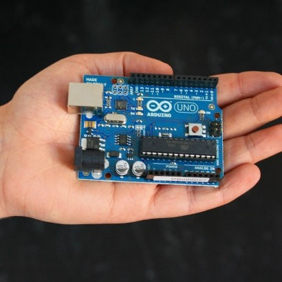

# Arduino版本

* Arduino Uno 我们最常用的一种板子。
* Arduino Nano 缩小版Arduino。
* Arduino Mega 板子比较大，运算能力比较强，可用在3D打印机上。

# Arduino程序烧录工具

[Arduino下载地址](http://www.chuang-ke.com/a/downloads/Arduino/2015/1205/211.html)

## Arduino IDE安装

1. 首先下载[Arduino下载地址](http://www.chuang-ke.com/a/downloads/Arduino/2015/1205/211.html)
2. 在电脑上安装该软件。
3. 通过USB插入Arduino开发板，一般会自动安装驱动。弹出的窗口都选择允许。如果驱动安装不成功，可以选择用驱动精灵检测，然后修复即可。
4. 将程序复制到空白界面，点上传按钮，当下方显示上传成功，即烧录完成。

