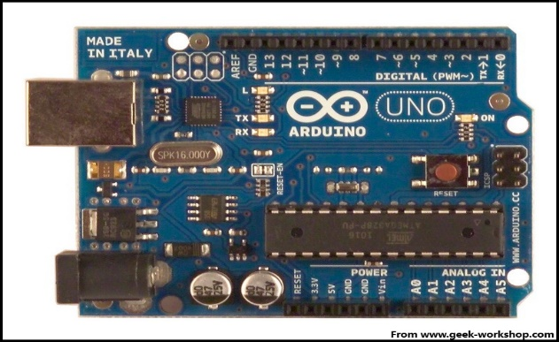
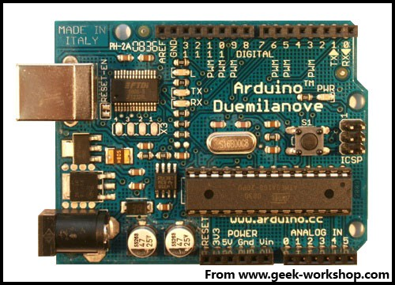
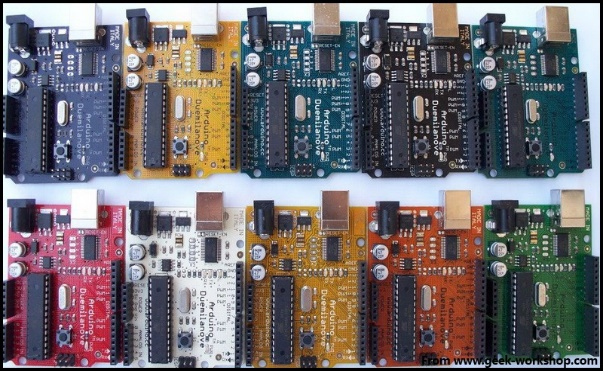
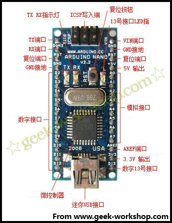
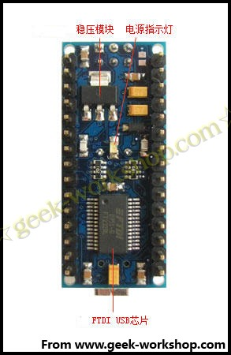

# Arduino基于AVR平台，对AVR库进行了二次编译封装，把端口都打包好了，寄存器啦、地址指针之类的基本不用管。大大降低了软件开发难度，适宜非专业爱好者使用。优点和缺点并存，因为是二次编译封装，代码不如直接使用AVR代码编写精练，代码执行效率与代码体积都弱于AVR直接编译。**性能：**Digital I/O 数字输入/输出端口0—13。Analog I/O 模拟输入/输出端口0-5。支持ICSP下载，支持TX/RX。输入电压：USB接口供电或者5V-12V外部电源供电。输出电压：支持3.3V级5V DC输出。处理器：使用Atmel Atmega168 328处理器，因其支持者众多，已有公司开发出来32位的MCU平台支持arduino。目前arduino的控制板最新的为Arduino Uno，如下图： 国内使用比较多的为Arduino Duemilanove 2009，主要原因是Uno的usb控制芯片封装方式改变，制造成本上升，其他变化不大，性价比还是Arduino Duemilanove 2009比较好。 因其开源特性，生产arduino控制板的厂商众多，同样的Duemilanove 2009就有很多种颜色。 对于一些对电路板大小要求比较严格的地方，arduino团队提供了arduino Nano，此板体积做的非常小。如下图：  arduino板子上基本端口如图描述，对几个比较特殊的端口下面详细说明下：VIN端口：VIN是input voltage的缩写，表示有外部电源时的输入端口。AREF:Reference voltage for the analog inputs(模拟输入的基准电压）。使用analogReference()命令调用。ICSP：也有称为ISP（In System Programmer)，就是一种线上即时烧录，目前比较新的芯片都支持这种烧录模式，包括大家常听说的8051系列的芯片，也都慢慢采用这种简便的烧录方式。我们都知道传统的烧录方式，都是将被烧录的芯片，从线路板上拔起，有的焊死在线路板上的芯片，还得先把芯片焊接下来才能烧录。为了解决这种问题，发明了ICSP线上即时烧录方式。只需要准备一条R232线（连接烧录器），以及一条连接烧录器与烧录芯片针脚的连接线就可以。电源的+5V，GND，两条负责传输烧录信息的针脚，再加上一个烧录电压针脚，这样就可以烧录了。 {#arduino-avr-avr-avr-avr-digital-i-o-0-13-analog-i-o-0-5-icsp-tx-rx-usb-5v-12v-3-3v-5v-dc-atmel-atmega168-328-32-mcu-arduino-arduino-arduino-uno-arduino-duemilanove-2009-uno-usb-arduino-duemilanove-2009-arduino-duemilanove-2009-arduino-arduino-nano-arduino-vin-vin-input-voltage-aref-reference-voltage-for-the-analog-inputs-analogreference-icsp-isp-in-system-programmer-8051-icsp-r232-5v-gnd}

