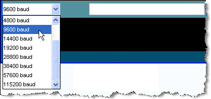
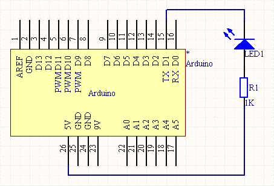

# arduino学习笔记11 Arduino的串口输出 {#arduino-11-arduino}

在许多实际应用场合中我们会要求在Arduino和其它设备之间实现相互通信，而最常见通常也是最简单的办法就是使用串行通信。在串行通信中，两个设备之间一个接一个地来回发送数字脉冲，它们之间必须严格遵循相应的协议以保证通信的正确性。

在PC机上上最常见的串行通信协议是RS-232串行协议，而在各种微控制器（单片机）上采用的则是TTL串行协议。由于这两者的电平有很大的不同，因此在实现PC机和微控制器的通信时，必须进行相应的转换。完成RS-232电平和TTL电平之间的转换一般采用专用芯片，如MAX232等，但在 Arduino上是用相应的电平转换电路来完成的。

根据Arduino的原理图我们不难看出，ATmega的RX和TX引脚一方面直接接到了数字I/O端口的0号和1号管脚，另一方面又通过电平转换电路接到了串口的母头上。因此，当我们需要用Arduino与PC机通信时，可以用串口线将两者连接起来；当我们需要用 Arduino与微控制器（如另一块Arduino）通信时，则可以用数字I/O端口的0号和1号管脚。

串行通信的难点在于参数的设置，如波特率、数据位、停止位等，在Arduino语言可以使用Serial.begin()函数来简化这一任务。为了实现数据的发送，Arduino则提供了Serial.print()和Serial.println()两个函数，它们的区别在于后者会在请求发送的数 据后面加上换行符，以提高输出结果的可读性。

在这一实验中没有用到额外的电路， 我们只需要用串口线将Arduino和PC机连起来就可以了，相应的代码为：

void setup() { Serial.begin(9600);}void loop() { Serial.println("Hello World!"); delay(1000);}

在将工程下载到Arduino模块中之后，在Arduino集成开发环境的工具栏中单击“Serial Monitor”控制，打开串口监视器：

接着将波特率设置为9600，即保持与工程中的设置相一致：

如果一切正常，此时我们就可以在Arduino集成开发环境的Console窗口中看到串口上输出的数据了：

为了检查串口上是否有数据发送，一个比较简单的办法是在数字I/O端口的1号管脚（TX）和5V电源之间接一个发光二极管，如下面的原理图所示：

这样一旦Arduino在通过串口向PC机发送数据时，相应的发光二极管就会闪烁，实际应用中这是一个非常方便的调试手段;-)

