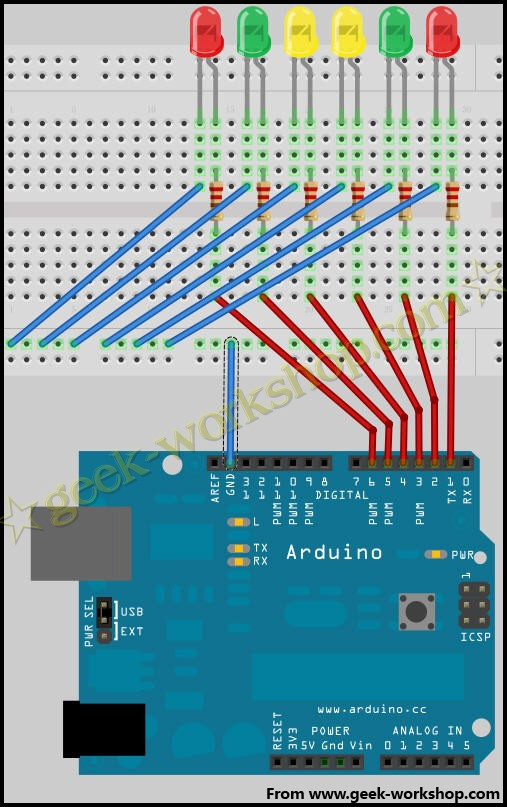
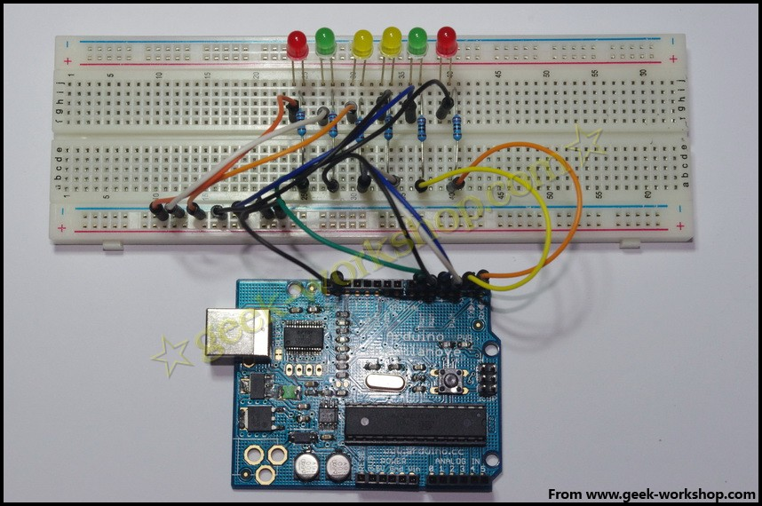

# arduino学习笔记16六灯闪烁实验 {#arduino-16}

通过上一节学习，知道了怎样让一个led进行闪烁，下面的实验会对六个led进行控制，先看硬件连接图。  按照上面的硬件连接方法接好后，咱们来测试两段程序，看看其中的差别。通过这两段程序介绍一下arduino的语言轮廓。

1.  //设置控制Led的数字IO脚
2.  int Led1 = 1;
3.  int Led2 = 2;
4.  int Led3 = 3;
5.  int Led4 = 4;
6.  int Led5 = 5;
7.  int Led6 = 6;
8.  //led灯花样显示样式1子程序
9.  void style_1(void)
10.  {
11.  unsigned char j;
12.  for(j=1;j<=6;j++)
13.  {
14.  digitalWrite(j,HIGH);
15.  delay(200);
16.  }
17.  for(j=6;j>=1;j--)
18.  {
19.  digitalWrite(j,LOW);
20.  delay(200);
21.  } 
22.  }
23.  void setup()
24.  { 
25.  unsigned char i;
26.  for(i=1;i<=6;i++)//依次设置1~6个数字引脚为输出模式
27.  pinMode(i,OUTPUT);//设置第i个引脚为输出模式
28.  }
29.  void loop()
30.  {   
31.  style_1();//样式1
32.  
33.  }

_复制代码_

上面代码的效果视频如下：[http://player.youku.com/player.php/sid/XMjgzOTA0Mjk2/v.swf](http://player.youku.com/player.php/sid/XMjgzOTA0Mjk2/v.swf)

1.  //设置控制Led的数字IO脚
2.  int Led1 = 1;
3.  int Led2 = 2;
4.  int Led3 = 3;
5.  int Led4 = 4;
6.  int Led5 = 5;
7.  int Led6 = 6;
8.  //led灯花样显示样式1子程序
9.  void style_1(void)
10.  {
11.  unsigned char j;
12.  for(j=1;j<=6;j++)
13.  digitalWrite(j,HIGH);
14.  delay(200);
15.  for(j=6;j>=1;j--)
16.  {
17.  digitalWrite(j,LOW);
18.  delay(200);
19.  } 
20.  }
21.  void setup()
22.  { 
23.  unsigned char i;
24.  for(i=1;i<=6;i++)//依次设置1~6个数字引脚为输出模式
25.  pinMode(i,OUTPUT);//设置第i个引脚为输出模式
26.  }
27.  void loop()
28.  {   
29.  style_1();//样式1
30.  
31.  }

_复制代码_

上面代码的效果视频如下：[http://player.youku.com/player.php/sid/XMjg0MDU5NjQ0/v.swf](http://player.youku.com/player.php/sid/XMjg0MDU5NjQ0/v.swf)通过下载测试，发现第一段程序是led 1-6逐个点亮，然后从6-1再逐个熄灭如此循环。第二段程序是6个灯同时亮，然后再6-1逐个熄灭如此循环。下面对产生不同效果的代码进行分析。下面这段代码代表的for语句循环的是，是把j点亮，然后再延迟200毫秒，然后再循环。形成的效果就是6个灯相隔200毫秒逐步被点亮。

1.  for(j=1;j<=6;j++)
2.  {
3.  digitalWrite(j,HIGH);
4.  delay(200);
5.  }

_复制代码_

下面这段代码其实是不规范写法，for命令表达要求一定要有{}循环，如果没有标出{}，编译时就会自动对下一句加上{}。如果代码量很大，出问题是查找起来会非常辛苦。

1.  for(j=1;j<=6;j++)
2.  digitalWrite(j,HIGH);
3.  delay(200);

_复制代码_

正确的写法应该是下面这个样子

1.  for(j=1;j<=6;j++)  {
2.  digitalWrite(j,HIGH);
3.  }
4.  delay(200);

_复制代码_

六个灯逐个被点亮，然后再延时200毫秒进入下一句。因为六灯逐个点亮的速度非常快，所以看上去像一起亮的。**void**（无类型）在arduino中是数据类型的一种，通常用来代表一个事件。如果控制过程比较简单void一般无需定义，直接使用

1.  void setup()
2.  {
3.  // ...
4.  }
5.  void loop()
6.  {
7.  // ...
8.  }

_复制代码_

代表事件的开始与事件的循环。如果控制过程比较复杂，一般就要设置多个子事件，把复杂的过程进行分解，每一个子事件定义为一个void数据。把以下代码上传上去，看看led灯是如何工作的。

1.  //设置控制Led的数字IO脚
2.  int Led1 = 1;
3.  int Led2 = 2;
4.  int Led3 = 3;
5.  int Led4 = 4;
6.  int Led5 = 5;
7.  int Led6 = 6;
8.  //led灯花样显示样式1子程序
9.  void style_1(void)
10.  {
11.  unsigned char j;
12.  for(j=1;j<=6;j++)//每隔200ms依次点亮1~6引脚相连的led灯
13.  {
14.  digitalWrite(j,HIGH);//点亮j引脚相连的led灯
15.  delay(200);//延时200ms
16.  }
17.  for(j=6;j>=1;j--)//每隔200ms依次熄灭6~1引脚相连的led灯
18.  {
19.  digitalWrite(j,LOW);//熄灭j引脚相连的led灯
20.  delay(200);//延时200ms
21.  } 
22.  }
23.  //灯闪烁子程序
24.  void flash(void)
25.  {   
26.  unsigned char j,k;
27.  for(k=0;k<=1;k++)//闪烁两次
28.  {
29.  for(j=1;j<=6;j++)//点亮1~6引脚相连的led灯
30.  digitalWrite(j,HIGH);//点亮与j引脚相连的led灯
31.  delay(200);//延时200ms
32.  for(j=1;j<=6;j++)//熄灭1~6引脚相连的led灯
33.  digitalWrite(j,LOW);//熄灭与j引脚相连的led灯
34.  delay(200);//延时200ms
35.  }
36.  }
37.  //led灯花样显示样式2子程序
38.  void style_2(void)
39.  {
40.  unsigned char j,k;
41.  k=1;//设置k的初值为1
42.  for(j=3;j>=1;j--)
43.  {   
44.  digitalWrite(j,HIGH);//点亮灯
45.  digitalWrite(j+k,HIGH);//点亮灯
46.  delay(400);//延时400ms
47.  k +=2;//k值加2
48.  }
49.  k=5;//设置k值为5
50.  for(j=1;j<=3;j++)
51.  {
52.  digitalWrite(j,LOW);//熄灭灯
53.  digitalWrite(j+k,LOW);//熄灭灯
54.  delay(400);//延时400ms
55.  k -=2;//k值减2
56.  }
57.  }
58.  //led灯花样显示样式3子程序
59.  void style_3(void)
60.  {
61.  unsigned char j,k;//led灯花样显示样式3子程序
62.  k=5;//设置k值为5
63.  for(j=1;j<=3;j++)
64.  {
65.  digitalWrite(j,HIGH);//点亮灯
66.  digitalWrite(j+k,HIGH);//点亮灯
67.  delay(400);//延时400ms
68.  digitalWrite(j,LOW);//熄灭灯
69.  digitalWrite(j+k,LOW);//熄灭灯
70.  k -=2;//k值减2
71.  }
72.  k=3;//设置k值为3
73.  for(j=2;j>=1;j--)
74.  {   
75.  digitalWrite(j,HIGH);//点亮灯
76.  digitalWrite(j+k,HIGH);//点亮灯
77.  delay(400);//延时400ms
78.  digitalWrite(j,LOW);//熄灭灯
79.  digitalWrite(j+k,LOW);//熄灭灯
80.  k +=2;//k值加2
81.  } 
82.  }
83.  void setup()
84.  { 
85.  unsigned char i;
86.  for(i=1;i<=6;i++)//依次设置1~6个数字引脚为输出模式
87.  pinMode(i,OUTPUT);//设置第i个引脚为输出模式
88.  }
89.  void loop()
90.  {   
91.  style_1();//样式1
92.  flash();//闪烁
93.  style_2();//样式2
94.  flash();//闪烁
95.  style_3();//样式3
96.  flash();//闪烁
97.  }

_复制代码_