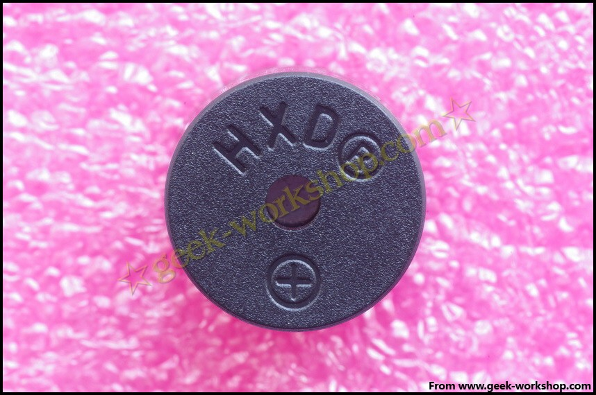
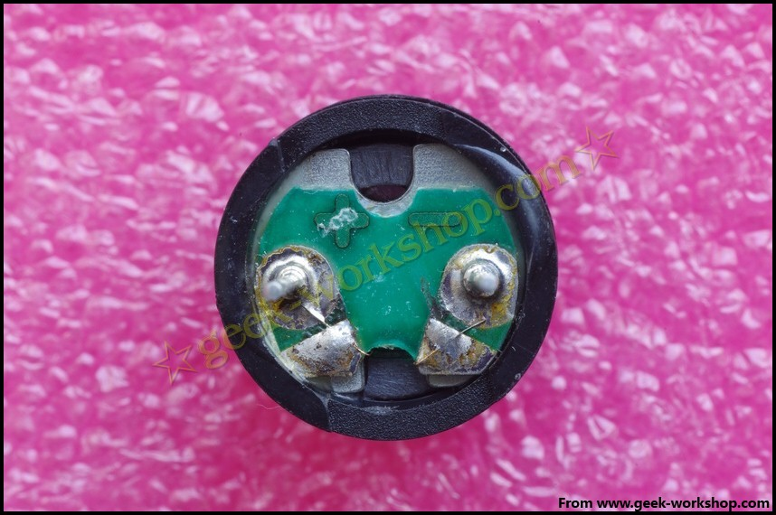
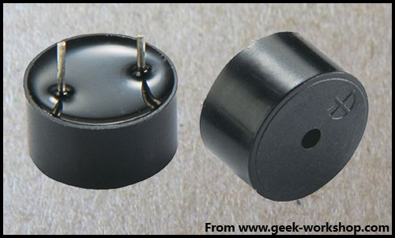
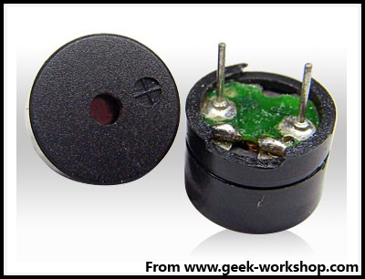
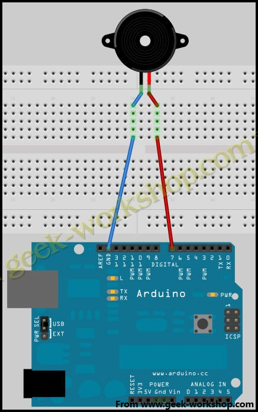
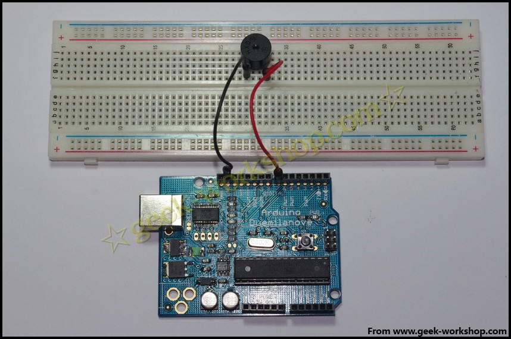

# arduino学习笔记17蜂鸣器实验 {#arduino-17}

本次实验所用的为下图所示的这种小型无源蜂鸣器  通过上网查询参数，得到其工作电压为5V，和arduino控制板数字端口输出电压一致，所以不需要接电阻。可直接接上使用。先简单介绍一下这种小型蜂鸣器。小型蜂鸣器因其体积小(直径只有6mm)、重量轻、价格低、结构牢靠，而广泛地应用在各种需要发声的电器设备、电子制作和单片机等电路中。这种蜂鸣器分有源蜂鸣器与无源蜂鸣器下图为有源蜂鸣器 下图为无源蜂鸣器 从外观上看，两种蜂鸣器好像一样，如果将蜂鸣器引脚朝上时，可以看到，有绿色电路板的是一种无源蜂鸣器，没有电路板而使用黑胶密封的是一种有源蜂鸣器。从外观上并不能绝对的区分出有源与无源，最可靠的做法除了查看产品的参数手册以外，还有就是使用万用表测试蜂鸣器电阻，只有8Ω或者16Ω的是无源蜂鸣器，电阻在几百欧以上的是有源蜂鸣器。有源蜂鸣器直接接上额定电源（新的蜂鸣器在标签上都有注明）就可以连续发声，而无源蜂鸣器则和电磁扬声器一样，需要接在音频输出电路中才能发声。简单介绍完蜂鸣器以后先看一下硬件连接示意图  把下面的代码上传到arduino控制板上，看看实验结果。

1.  int buzzer=7;//设置控制蜂鸣器的数字IO脚
2.  void setup()
3.  {
4.  pinMode(buzzer,OUTPUT);//设置数字IO脚模式，OUTPUT为输出
5.  }
6.  void loop()
7.  {
8.  unsigned char i,j;//定义变量
9.  while(1)
10.  {
11.  for(i=0;i<80;i++)//输出一个频率的声音
12.  {
13.  digitalWrite(buzzer,HIGH);//发声音
14.  delay(1);//延时1ms
15.  digitalWrite(buzzer,LOW);//不发声音
16.  delay(1);//延时ms
17.  }
18.  for(i=0;i<100;i++)//输出另一个频率的声音
19.  {
20.  digitalWrite(buzzer,HIGH);//发声音
21.  delay(2);//延时2ms
22.  digitalWrite(buzzer,LOW);//不发声音
23.  delay(2);//延时2ms
24.  }
25.  }
26.  }

_复制代码_