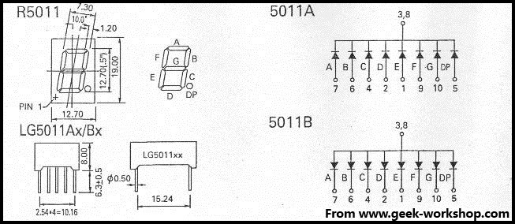
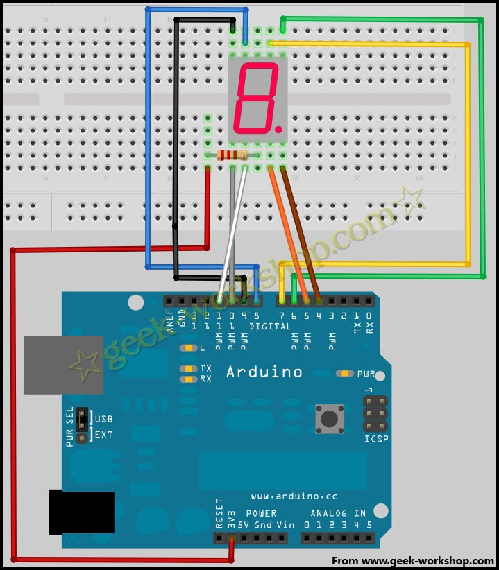
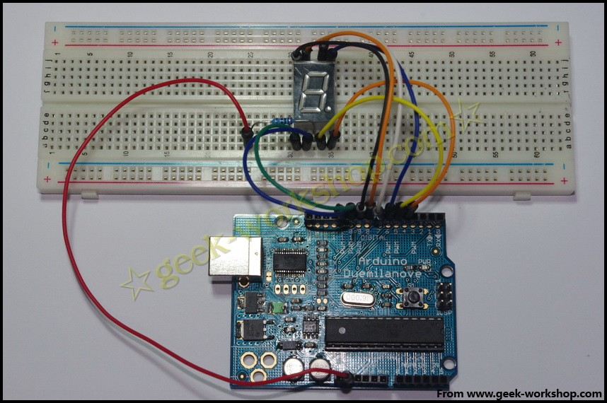

# arduino学习笔记18数码管实验 {#arduino-18}

**数码管介绍**数码管是一种半导体发光器件，其基本单元是发光二极管。数码管按段数分为七段数数码管和八段数数码管，八段数数码管比七段数数码管多一个发光二极管单元（多一个小数点显示）发光二极管单元连接方式分为共阳数码管和共阴数码管。共阳数码管是指将所有发光二极管的阳极连接到一起形成公共阳极（COM）的数码管。共阳数码管在应用时应将公共极PWR接到电源输入PWR上，当某一字段发光二极管的阴极为低电平时，相应字段就点亮。当某一字段的阴极为高电平时，相应字段就不亮。共阴数码管则更好相反，阴极连接到一起形成了公共阴极，阳极是独立分开的。先来看一下本次实验使用的数码管。通过查询型号LG5011BSR得知其为0.5"单联共阳数码管，下面是其引脚图。 查看其背后，四个角分别有2个原点和5，10两个标记。分别表示了1,6,5,10针脚。数码管和发光二极管一样，需要添加限流电阻，因为网上没有查到资料说明该数码管的击穿电压是多大。所以供给电源电压宁可小不可大，所以选择220Ω限流电阻，和3.3V供电。线路连接图如下  把下面的代码编译后下载到控制板上，看看效果~

1.  //设置控制各段的数字IO脚，具体几号引脚对应哪一段，来源为数码管官方引脚图。
2.  int a=7;
3.  int b=6;
4.  int c=5;
5.  int d=11;
6.  int e=10;
7.  int f=8;
8.  int g=9;
9.  int dp=4;
10.  //显示数字1
11.  void digital_1(void)
12.  {
13.  unsigned char j;
14.  digitalWrite(c,LOW);//给数字5引脚低电平，点亮c段
15.  digitalWrite(b,LOW);//点亮b段
16.  for(j=7;j<=11;j++)//熄灭其余段
17.  digitalWrite(j,HIGH);
18.  digitalWrite(dp,HIGH);//熄灭小数点DP段
19.  }
20.  //显示数字2
21.  void digital_2(void)
22.  {
23.  unsigned char j;
24.  digitalWrite(b,LOW);
25.  digitalWrite(a,LOW);
26.  for(j=9;j<=11;j++)
27.  digitalWrite(j,LOW);
28.  digitalWrite(dp,HIGH);
29.  digitalWrite(c,HIGH);
30.  digitalWrite(f,HIGH);
31.  }
32.  //显示数字3
33.  void digital_3(void)
34.  {
35.  unsigned char j;
36.  digitalWrite(g,LOW);
37.  digitalWrite(d,LOW);
38.  for(j=5;j<=7;j++)
39.  digitalWrite(j,LOW);
40.  digitalWrite(dp,HIGH);
41.  digitalWrite(f,HIGH);
42.  digitalWrite(e,HIGH);
43.  }
44.  //显示数字4
45.  void digital_4(void)
46.  {
47.  digitalWrite(c,LOW);
48.  digitalWrite(b,LOW);
49.  digitalWrite(f,LOW);
50.  digitalWrite(g,LOW);
51.  digitalWrite(dp,HIGH);
52.  digitalWrite(a,HIGH);
53.  digitalWrite(e,HIGH);
54.  digitalWrite(d,HIGH);   
55.  }
56.  //显示数字5
57.  void digital_5(void)
58.  {
59.  unsigned char j;
60.  for(j=7;j<=9;j++)
61.  digitalWrite(j,LOW);
62.  digitalWrite(c,LOW);
63.  digitalWrite(d,LOW);
64.  digitalWrite(dp,HIGH);
65.  digitalWrite(b,HIGH);
66.  digitalWrite(e,HIGH); 
67.  }
68.  //显示数字6
69.  void digital_6(void)
70.  {
71.  unsigned char j;
72.  for(j=7;j<=11;j++)
73.  digitalWrite(j,LOW);
74.  digitalWrite(c,LOW);
75.  digitalWrite(dp,HIGH);
76.  digitalWrite(b,HIGH);   
77.  }
78.  //显示数字7
79.  void digital_7(void)
80.  {
81.  unsigned char j;
82.  for(j=5;j<=7;j++)
83.  digitalWrite(j,LOW);
84.  digitalWrite(dp,HIGH);
85.  for(j=8;j<=11;j++)
86.  digitalWrite(j,HIGH);
87.  }
88.  //显示数字8
89.  void digital_8(void)
90.  {
91.  unsigned char j;
92.  for(j=5;j<=11;j++)
93.  digitalWrite(j,LOW);
94.  digitalWrite(dp,HIGH);
95.  }
96.  void setup()
97.  {
98.  int i;//定义变量
99.  for(i=4;i<=11;i++)
100.  pinMode(i,OUTPUT);//设置4～11引脚为输出模式
101.  }
102.  void loop()
103.  {  
104.  while(1)
105.  {
106.  digital_1();//数字1
107.  delay(2000);//延时2s
108.  digital_2();
109.  delay(2000);
110.  digital_3();
111.  delay(2000);
112.  digital_4();
113.  delay(2000);
114.  digital_5();
115.  delay(2000);
116.  digital_6();
117.  delay(2000);
118.  digital_7();
119.  delay(2000);
120.  digital_8();
121.  delay(2000);   
122.  }
123.  }

_复制代码_