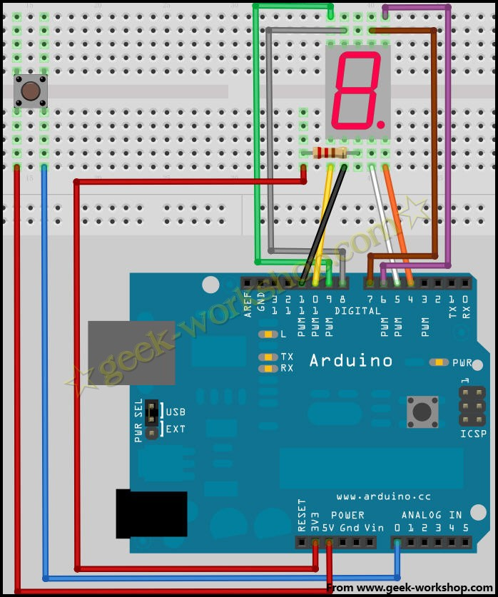
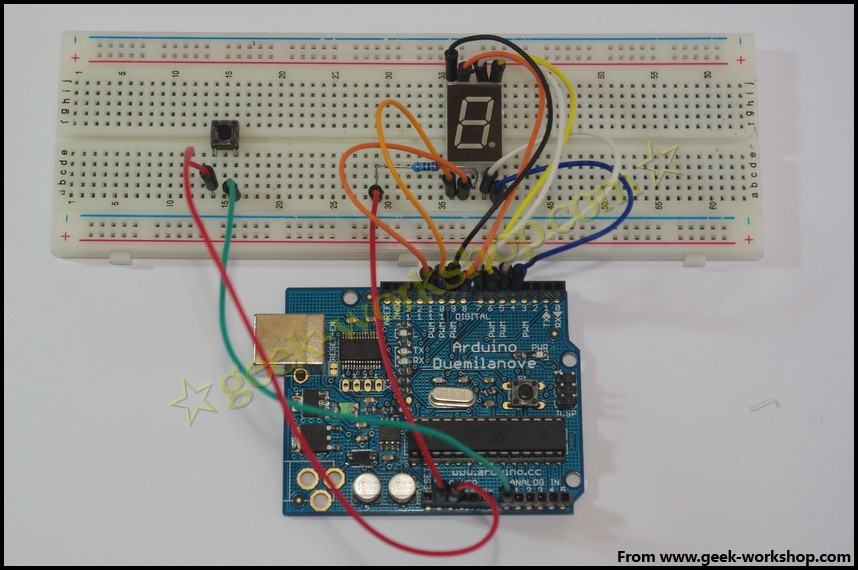

# arduino学习笔记21数字骰子实验 {#arduino-21}

前几次做了数码管实验和按键控制LED的实验，通过实验大家已经学会了两种器件的基本用法。这次使用数码管与按键进行组合，做一个简易数字骰子。数字筛子的基本原理是数码管快速在1-8之间循环跳动，当按下按键时，数码管定格在当前的数字上，不再跳动。先看一下接线图 

1.  //设置控制各段的数字IO脚
2.  int a=7;
3.  int b=6;
4.  int c=5;
5.  int d=11;
6.  int e=10;
7.  int f=8;
8.  int g=9;
9.  int dp=4;
10.  //显示数字1
11.  void digital_1(void)
12.  {
13.  unsigned char j;
14.  digitalWrite(c,LOW);//给数字5引脚低电平，点亮c段
15.  digitalWrite(b,LOW);//点亮b段
16.  for(j=7;j<=11;j++)//熄灭其余段
17.  digitalWrite(j,HIGH);
18.  digitalWrite(dp,HIGH);//熄灭小数点DP段
19.  }
20.  //显示数字2
21.  void digital_2(void)
22.  {
23.  unsigned char j;
24.  digitalWrite(b,LOW);
25.  digitalWrite(a,LOW);
26.  for(j=9;j<=11;j++)
27.  digitalWrite(j,LOW);
28.  digitalWrite(dp,HIGH);
29.  digitalWrite(c,HIGH);
30.  digitalWrite(f,HIGH);
31.  }
32.  //显示数字3
33.  void digital_3(void)
34.  {
35.  unsigned char j;
36.  digitalWrite(g,LOW);
37.  digitalWrite(d,LOW);
38.  for(j=5;j<=7;j++)
39.  digitalWrite(j,LOW);
40.  digitalWrite(dp,HIGH);
41.  digitalWrite(f,HIGH);
42.  digitalWrite(e,HIGH);
43.  }
44.  //显示数字4
45.  void digital_4(void)
46.  {
47.  digitalWrite(c,LOW);
48.  digitalWrite(b,LOW);
49.  digitalWrite(f,LOW);
50.  digitalWrite(g,LOW);
51.  digitalWrite(dp,HIGH);
52.  digitalWrite(a,HIGH);
53.  digitalWrite(e,HIGH);
54.  digitalWrite(d,HIGH);   
55.  }
56.  //显示数字5
57.  void digital_5(void)
58.  {
59.  unsigned char j;
60.  for(j=7;j<=9;j++)
61.  digitalWrite(j,LOW);
62.  digitalWrite(c,LOW);
63.  digitalWrite(d,LOW);
64.  digitalWrite(dp,HIGH);
65.  digitalWrite(b,HIGH);
66.  digitalWrite(e,HIGH); 
67.  }
68.  //显示数字6
69.  void digital_6(void)
70.  {
71.  unsigned char j;
72.  for(j=7;j<=11;j++)
73.  digitalWrite(j,LOW);
74.  digitalWrite(c,LOW);
75.  digitalWrite(dp,HIGH);
76.  digitalWrite(b,HIGH);   
77.  }
78.  //显示数字7
79.  void digital_7(void)
80.  {
81.  unsigned char j;
82.  for(j=5;j<=7;j++)
83.  digitalWrite(j,LOW);
84.  digitalWrite(dp,HIGH);
85.  for(j=8;j<=11;j++)
86.  digitalWrite(j,HIGH);
87.  }
88.  //显示数字8
89.  void digital_8(void)
90.  {
91.  unsigned char j;
92.  for(j=5;j<=11;j++)
93.  digitalWrite(j,LOW);
94.  digitalWrite(dp,HIGH);
95.  }
96.  void setup()
97.  {
98.  int i;
99.  for(i=4;i<=11;i++)
100.  {
101.  pinMode(i,OUTPUT);//设置4~11口为输出模式
102.  }
103.  }
104.  void loop()
105.  {  
106.  while(1)
107.  {
108.  digital_1();//显示数字1
109.  while(analogRead(0)>1000);//如果读到模拟0口的值1000则说明有按键按下
110.  delay(100);//延时200ms
111.  digital_2();
112.  while(analogRead(0)>1000);
113.  delay(100);
114.  digital_3();
115.  while(analogRead(0)>1000);
116.  delay(100);
117.  digital_4();
118.  while(analogRead(0)>1000);
119.  delay(100);
120.  digital_5();
121.  while(analogRead(0)>1000);
122.  delay(100);
123.  digital_6();
124.  while(analogRead(0)>1000);
125.  delay(100);
126.  digital_7();
127.  while(analogRead(0)>1000);
128.  delay(100);
129.  digital_8();
130.  while(analogRead(0)>1000);
131.  delay(100); 
132.  }
133.  }

_复制代码_