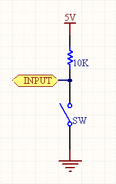
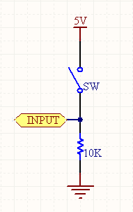
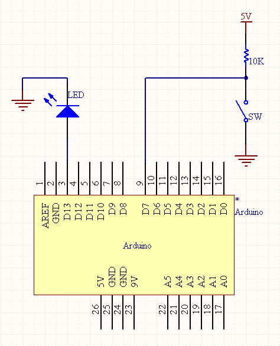

# arduino学习笔记8数字输入 {#arduino-8}

在数字电路中开关（switch）是一种基本的输入形式，它的作用是保持电路的连接或者断开。Arduino从数字I/O管脚上只能读出高电平（5V）或者低电平（0V），因此我们首先面临到的一个问题就是如何将开关的开/断状态转变成Arduino能够读取的高/低电平。解决的办法是通过上 /下拉电阻，按照电路的不同通常又可以分为正逻辑（Positive Logic）和负逻辑（Inverted Logic）两种。

在正逻辑电路中，开关一端接电源，另一端则通过一个10K的下拉电阻接地，输入信号从开关和电阻间引出。当开关断开的时候，输入信号被电阻“拉”向地，形成低电平（0V）；当开关接通的时候，输入信号直接与电源相连，形成高电平。对于经常用到的按压式开关来讲，就是按下为高，抬起为低。

在负逻辑电路中，开关一端接地，另一端则通过一个10K的上拉电阻接电源，输入信号同样也是从开关和电阻间引出。当开关断开时，输入信号被电阻“拉”向电源，形成高电平（5V）；当开关接通的时候，输入信号直接与地相连，形成低电平。对于经常用到的按压式开关来讲，就是按下为低，抬起为高。

为了验证Arduino数字I/O的输入功能，我们可以将开关接在Arduino的任意一个数字I/O管脚上（13除外），并通过读取它的接通或者断开状态，来控制其它数字I/O管脚的高低。本实验采用的原理图如下所示，其中开关接在数字I/O的7号管脚上，被控的发光二极管接在数字I/O的13号 管脚上：

相应的代码为：

int ledPin = 13;int switchPin = 7;int value = 0;void setup() {pinMode(ledPin, OUTPUT);pinMode(switchPin, INPUT);}void loop() {value = digitalRead(switchPin);if (HIGH == value) {    // turn LED off    digitalWrite(ledPin, LOW);} else {    // turn LED on    digitalWrite(ledPin, HIGH);}}

由于采用的是负逻辑电路，开关按下时用digitalRead()函数读取到的值为LOW，此时再用digitalWrite()函数将发光二极管所在的管脚置为高，点亮发光二极管。同理，当开关抬起时，发光二极管将被熄灭，这样我们就实现了用开关来控制发光二极管的功能。