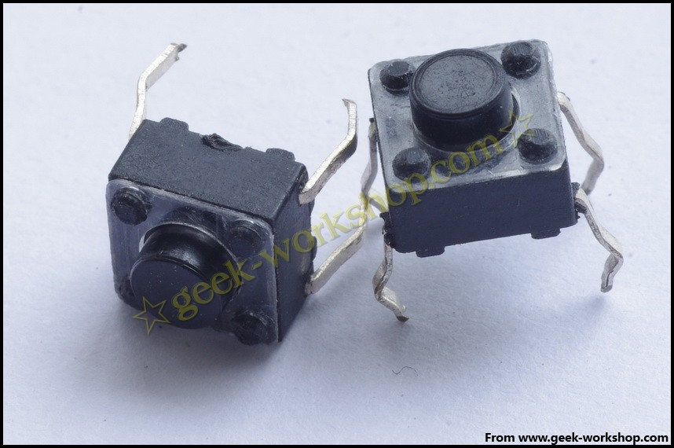
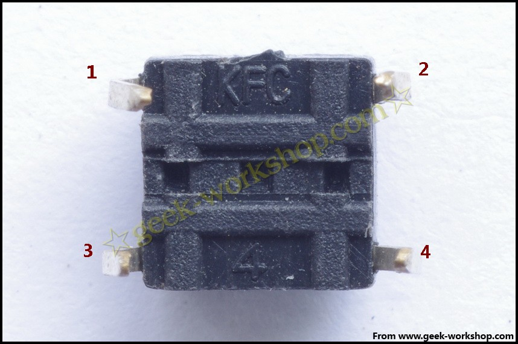
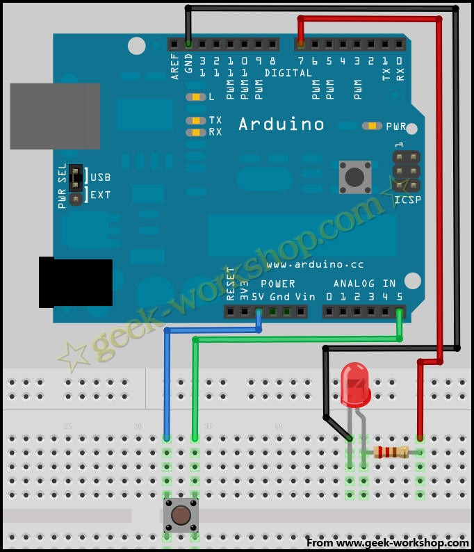
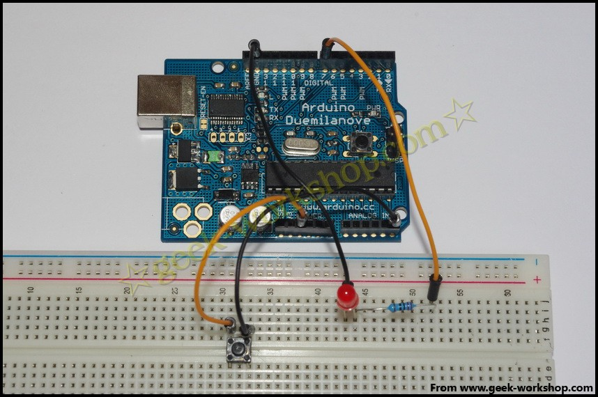
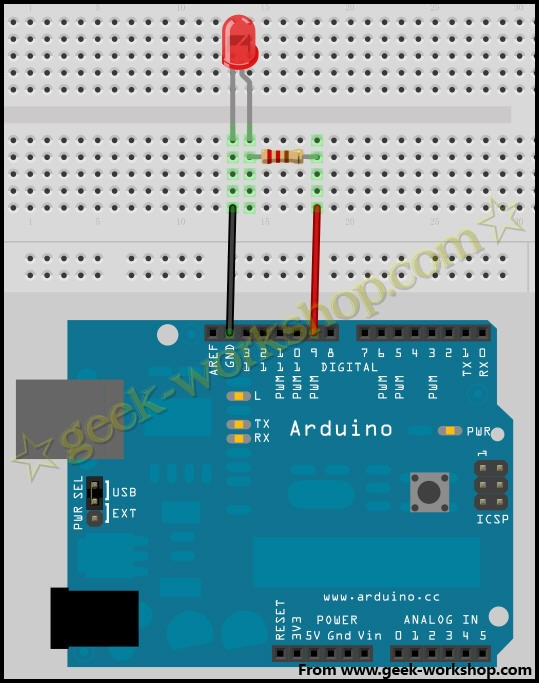
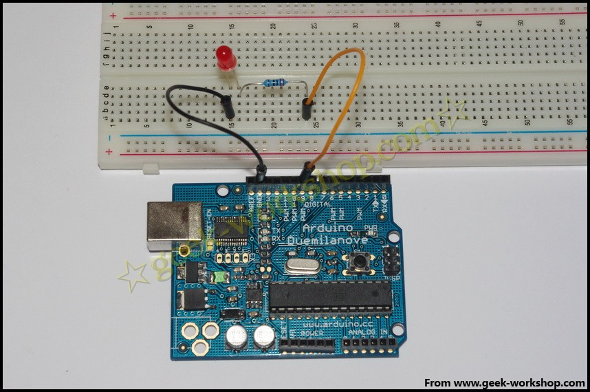
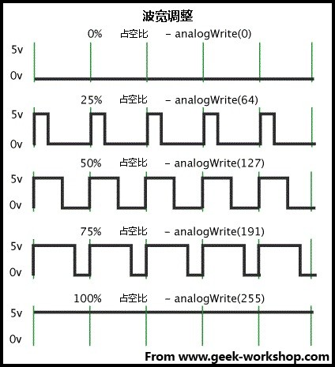

# 本次试验的效果为数码管1,2,3,4,5,6,7,8这样子循环显示。[http://player.youku.com/player.php/sid/XMjgzNzQ4Mzk2/v.swf](http://player.youku.com/player.php/sid/XMjgzNzQ4Mzk2/v.swf) {#1-2-3-4-5-6-7-8-http-player-youku-com-player-php-sid-xmjgznzq4mzk2-v-swf}

arduino学习笔记19按键实验

按键是一种常用的控制电器元件，常用来接通或断开电路，从而达到控制电机或者其他设备运行的开关。按键的外观多种多样，本次实验使用的是这种微型按键，6mm的，如下图。 此种按键有4个脚，从背面看是这样子的。  在按键没有按下去的时候1，2号脚相连，3,4号脚相连。按键按下去的时候，1,2,3,4号脚就全部接通。本次实验使用按键来控制led的亮或者灭。一般情况是直接把按键开关串联在led的电路中来开关，这种应用情况比较单一。这次实验通过间接的方法来控制，按键接通后判断按键电路中的输出电压，如果电压大于4.88V，就使给LED电路输出高电平，反之就输出低电平。使用逻辑判断的方法来控制LED亮或者灭，此种控制方法应用范围较广。本次连接方法如下图。按键开关两段一端连接5V接口，一端连接模拟5号口。LED长针脚串联220Ω电阻连接数字7号口，短针脚连接GND。  把下面的代码上传到arduino控制板上，看看效果。

1.  int key=7;//设置LED的数字IO脚
2.  void setup()
3.  {
4.  pinMode(key,OUTPUT);//设置数字IO引脚为输出模式
5.  }
6.  void loop()
7.  {
8.  int i;//定义变量
9.  while(1)
10.  {
11.  i=analogRead(5);//读取模拟5口电压值
12.  if(i>1000)//如果电压值大于1000（即4.88V）
13.  digitalWrite(key,HIGH);//设置第七引脚为高电平，点亮led灯
14.  else
15.  digitalWrite(key,LOW);//设置第七引脚为低电平，熄灭led灯 
16.  }
17.  }

复制代码

本次实验的效果如下[http://player.youku.com/player.php/sid/XMjgzNDMwNzcy/v.swf](http://player.youku.com/player.php/sid/XMjgzNDMwNzcy/v.swf)本次实验使用到analogRead()这个新命令。analogRead()作用是读取模拟口的数值。默认是把0-5V的输入电压分成1024份，每一份大约为0.049V，其数值在0-1023之间。在本次程序代码中的读取数值如果大于512则给LED输出高电平， 所对应的电压也就为大于2.5V。analogRead()命令输入的范围与分辨率可以使用analogReference()命令进行改动。刚开始本实验选用的判断标准是512，也就是2.5V。但是有网友按照教程的方法进行试验发现有问题，有时不需要按按钮灯就会自己亮。根据多次试验与分析后，确定其为各种干扰所致。比如感应电流等等不少都是大于2.5V的，所以为了提高准确度，只能提高判断的电压，本次实验就是提高到1000（4.88V）。人体自身也带电，早中晚还个不一样。下面的实验就是把模拟5号口判断标准定位512，用手去触摸模拟5号口导线就可以点亮LED。[http://player.youku.com/player.php/sid/XMjgzNDMwODk2/v.swf](http://player.youku.com/player.php/sid/XMjgzNDMwODk2/v.swf)

arduino学习笔记20 PWM控制LED实验 PWM讲解

本次实验通过PWM来控制一盏LED灯，让它慢慢变亮再慢慢变暗，如此循环。下面是接线图： 

1.  /*
2.  本次实验演示如何通过analogWrite()命令使连接9号端口的LED灯亮度逐渐变化
3.  */
4.  int brightness = 0;    //定义整数型变量brightness与其初始值，此变量用来表示LED的亮度。
5.  int fadeAmount = 5;    //定义整数型变量fadeAmount，此变量用来做亮度变化的增减量。
6.  void setup()  { 
7.  
8.  pinMode(9, OUTPUT);// 设置9号口为输出端口:
9.  } 
10.  void loop()  { 
11.  
12.  analogWrite(9, brightness);//把brightness的值写入9号端口
13.  brightness = brightness + fadeAmount;//改变brightness值，使亮度在下一次循环发生改变
14.  
15.  if (brightness == 0 || brightness == 255) {
16.  fadeAmount = -fadeAmount ; //在亮度最高与最低时进行翻转
17.  }     
18.  
19.  delay(30); //延时30毫秒                       
20.  }

复制代码

本次实验效果如下：[http://player.youku.com/player.php/sid/XMjgzNTI5MDI4/v.swf](http://player.youku.com/player.php/sid/XMjgzNTI5MDI4/v.swf)**analogWrite()**其作用是给端口写入一个模拟值(PWM波)。可以用来控制LED灯的亮度变化，或者以不同的速度驱动马达。当执行analogWrite()命令后，端口会输出一个稳定的占空比的方波。除非有下一个命令来改变它。PWM信号的频率大约为490Hz.在使用ATmega168与ATmega328的arduino控制板上，其工作在3,5,6,9,10,11端口。Arduino Mega控制板，可以工作于2-13号端口。在更古老的基于ATmega8的arduino控制板上，analogWrite()命令只能工作于9,10,11号端口。在使用analogWrite()命令前，可以不使用pinMode()命令把端口定义为输出端口，当然如果定义了更好，这样利于程序语言规范。**语法**analogWrite(pin, value)**参数**pin:写入的端口value:占空比:在0-255之间。**注释与已知问题**当PWM输出与5,6号端口的时候，会产生比预期更高的占空比。原因是PWM输出所使用的内部时钟，millis()与delay()两函数也在使用。所以要注意使用5,6号端口时，空占比要设置的稍微低一些，或者会产生5,6号端口无法输出完全关闭的信号。**PWM（Pulse-width modulation）脉宽调制**PWM是使用数字手段来控制模拟输出的一种手段。使用数字控制产生占空比不同的方波（一个不停在开与关之间切换的信号)来控制模拟输出。额~~这个说的太专业了，还是说的通俗点。以本次实验来看，端口的输入电压只有两个0V与5V。如我我想要3V的输出电压怎么办。。。有同学说串联电阻，对滴，这个方法是正确滴。但是如果我想1V,3V,3.5V等等之间来回变动怎么办呢？不可能不停地切换电阻吧。这种情况下。。。就需要使用PWM了。他是怎么控制的呢，对于arduino的数字端口电压输出只有LOW与HIGH两个开关，对应的就是0V与5V的电压输出，咱本把LOW定义为0，HIGH定义为1.一秒内让arduino输出500个0或者1的信号。如果这500个全部为1，那就是完整的5V，如果全部为0，那就是0V。如果010101010101这样输出，刚好一半一半，输出端口就感觉是2.5V的电压输出了。这个和咱们放映电影是一个道理，咱们所看的电影并不是完全连续的，它其实是每秒输出25张图片，在这种情况下人的肉眼是分辨不出来的，看上去就是连续的了。PWM也是同样的道理，如果想要不同的电压，就控制0与1的输出比例控制就ok~当然。。。这和真实的连续输出还是有差别的，单位时间内输出的0,1信号越多，控制的就越精确。在下图中，绿线之间代表一个周期，其值也是PWM频率的倒数。换句话说，如果arduino PWM的频率是500Hz，那么两绿线之间的周期就是2毫秒。 analogWrite() 命令中可以操控的范围为0-255， analogWrite(255)表示100%占空比（常开）， analogWrite(127)占空比大约为50%（一半的时间）。 **传统方法实现PWM**除了使用analogWrite()命令实现PWM，还可以通过传统方法来控制电平的开关时间来设置。请看如下代码

1.  void setup()
2.  {
3.  pinMode(13, OUTPUT);//设定13号端口为输出
4.  }
5.  void loop()
6.  {
7.  digitalWrite(13, HIGH);
8.  delayMicroseconds(100); // 大约10%占空比的1KHz方波
9.  digitalWrite(13, LOW);
10.  delayMicroseconds(900);
11.  }

复制代码

这种方法的的优点是他可以使用任意数字端口做输出端口。而且可以自己随意设定占空比与频率。一个主要的缺点是任何中断都会影响时钟，这样就会导致很大的抖动，除非你禁用中断。第二个却就是CPU在处理输出的时候，就无法做其他事情了。上面的代码用到了一个新的命令**delayMicroseconds()**其作用是产生一个延时，计量单位是微秒，1000微秒=1毫秒。目前delayMicroseconds()最大值为16383。如果值大于1000，推荐使用delay() 命令。