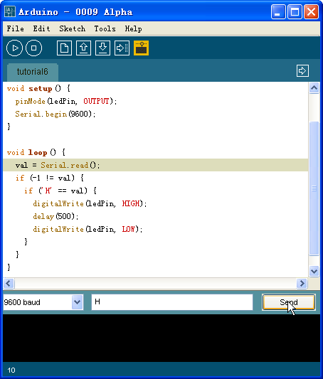
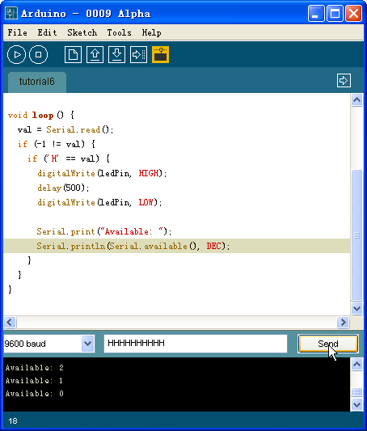
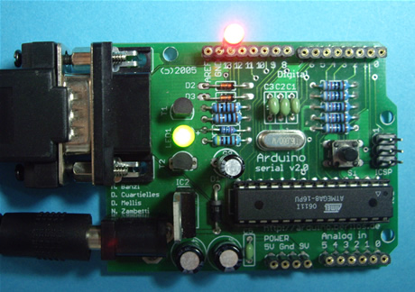

# 串口输入

## 串口输入

串行通信是在实现在PC机与微控制器进行交互的最简单的办法。之前的PC机上一般都配有标准的 RS-232或者RS-422接口来实现串行通信，但现在这种情况已经发生了一些改变，大家更倾向于使用USB这样一种更快速但同时也更加复杂的方式来实现串行通信。尽管在有些计算机上现在已经找不到RS-232或者RS-422接口了，但我们仍可以通过USB/串口或者PCMCIA/串口这样的转换器， 在这些设备上得到传统的串口。

通过串口连接的Arduino在交互式设计中能够为PC机提供一种全新的交互方式，比如用PC机控制一些之前看来非常复杂的事情，像声音和视频等。很多场合中都要求Arduino能够通过串口接收来自于PC机的命令，并完成相应的功能，这可以通过Arduino语言中提供的 Serial.read()函数来实现。

在这一实验中我们同样不需要任何额外的电路，而只需要用串口线将Arduino和PC机连起来就可以了，相应的Arduino工程代码为：

int ledPin = 13;int val; void setup() {pinMode(ledPin, OUTPUT);Serial.begin(9600);} void loop() {val = Serial.read();if (-1 != val) {    if ('H' == val) {      digitalWrite(ledPin, HIGH);      delay(500);      digitalWrite(ledPin, LOW);    }}}

把工程下载到Arduino模块中之后，在Arduino集成开发环境中打开串口监视器并将波特率设置为9600，然后向Arduino模块发送字符H，如下图所示：

该工程运行起来之后会不断调用Serial.read()函数从串口获得数据。Arduino语言提供的这个函数是不阻塞的，也就是说不论串口上是否真的有数据到达，该函数都会立即返回。Serial.read()函数每次只读取一个字节的数据，当串口上有数据到达的时候，该函数的返回值为到达的数 据中第一个字符的ASCII码；当串口上没有数据到达的时候，该函数的返回值则为-1。

Arduino语言的参考手册中没 有对Serial.read()函数做过多的说明，我的一个疑问是如果PC机一次发送的数据太多，Arduino是否提供相应的串口缓存功能来保证数据不会丢失？Arduino语言中提供的另外一个函数Serial.available()或许能够帮助我们用实验来进行验证：

int ledPin = 13;int val; void setup() {pinMode(ledPin, OUTPUT);Serial.begin(9600);} void loop() {val = Serial.read();if (-1 != val) {    if ('H' == val) {      digitalWrite(ledPin, HIGH);      delay(500);      digitalWrite(ledPin, LOW); Serial.print("Available: ");      Serial.println(Serial.available(), DEC);    }}}

函数Serial.available()的功能是返回串口缓冲区中当前剩余的字符个数，按照Arduino提供的该函数的说明，串口缓冲区中最多能缓冲128个字节。我们可以一次给Arduino模块发送多个字符，来验证这一功能：

在这一实验中，每当Arduino成功收到一个字符H，连接在数字I/O端口管脚13上的发光二极管就会闪烁一次：

