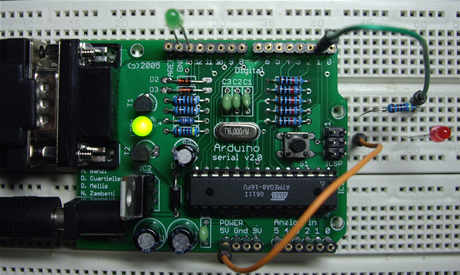

# 串口输入

## 串口输入

串行通信是在实现在PC机与微控制器进行交互的最简单的办法。之前的PC机上一般都配有标准的 RS-232或者RS-422接口来实现串行通信，但现在这种情况已经发生了一些改变，大家更倾向于使用USB这样一种更快速但同时也更加复杂的方式来实现串行通信。尽管在有些计算机上现在已经找不到RS-232或者RS-422接口了，但我们仍可以通过USB/串口或者PCMCIA/串口这样的转换器， 在这些设备上得到传统的串口。

通过串口连接的Arduino在交互式设计中能够为PC机提供一种全新的交互方式，比如用PC机控制一些之前看来非常复杂的事情，像声音和视频等。很多场合中都要求Arduino能够通过串口接收来自于PC机的命令，并完成相应的功能，这可以通过Arduino语言中提供的 Serial.read()函数来实现。

在这一实验中我们同样不需要任何额外的电路，而只需要用串口线将Arduino和PC机连起来就可以了，相应的Arduino工程代码为：

int ledPin = 13;int val; void setup() {pinMode(ledPin, OUTPUT);Serial.begin(9600);} void loop() {val = Serial.read();if (-1 != val) {    if ('H' == val) {      digitalWrite(ledPin, HIGH);      delay(500);      digitalWrite(ledPin, LOW);    }}}

把工程下载到Arduino模块中之后，在Arduino集成开发环境中打开串口监视器并将波特率设置为9600，然后向Arduino模块发送字符H，如下图所示：

该工程运行起来之后会不断调用Serial.read()函数从串口获得数据。Arduino语言提供的这个函数是不阻塞的，也就是说不论串口上是否真的有数据到达，该函数都会立即返回。Serial.read()函数每次只读取一个字节的数据，当串口上有数据到达的时候，该函数的返回值为到达的数 据中第一个字符的ASCII码；当串口上没有数据到达的时候，该函数的返回值则为-1。

Arduino语言的参考手册中没 有对Serial.read()函数做过多的说明，我的一个疑问是如果PC机一次发送的数据太多，Arduino是否提供相应的串口缓存功能来保证数据不会丢失？Arduino语言中提供的另外一个函数Serial.available()或许能够帮助我们用实验来进行验证：

int ledPin = 13;int val; void setup() {pinMode(ledPin, OUTPUT);Serial.begin(9600);} void loop() {val = Serial.read();if (-1 != val) {    if ('H' == val) {      digitalWrite(ledPin, HIGH);      delay(500);      digitalWrite(ledPin, LOW); Serial.print("Available: ");      Serial.println(Serial.available(), DEC);    }}}

函数Serial.available()的功能是返回串口缓冲区中当前剩余的字符个数，按照Arduino提供的该函数的说明，串口缓冲区中最多能缓冲128个字节。我们可以一次给Arduino模块发送多个字符，来验证这一功能：

在这一实验中，每当Arduino成功收到一个字符H，连接在数字I/O端口管脚13上的发光二极管就会闪烁一次：

# 串口输出

在许多实际应用场合中我们会要求在Arduino和其它设备之间实现相互通信，而最常见通常也是最简单的办法就是使用串行通信。在串行通信中，两个设备之间一个接一个地来回发送数字脉冲，它们之间必须严格遵循相应的协议以保证通信的正确性。

在PC机上上最常见的串行通信协议是RS-232串行协议，而在各种微控制器（单片机）上采用的则是TTL串行协议。由于这两者的电平有很大的不同，因此在实现PC机和微控制器的通信时，必须进行相应的转换。完成RS-232电平和TTL电平之间的转换一般采用专用芯片，如MAX232等，但在 Arduino上是用相应的电平转换电路来完成的。

根据Arduino的原理图我们不难看出，ATmega的RX和TX引脚一方面直接接到了数字I/O端口的0号和1号管脚，另一方面又通过电平转换电路接到了串口的母头上。因此，当我们需要用Arduino与PC机通信时，可以用串口线将两者连接起来；当我们需要用 Arduino与微控制器（如另一块Arduino）通信时，则可以用数字I/O端口的0号和1号管脚。

串行通信的难点在于参数的设置，如波特率、数据位、停止位等，在Arduino语言可以使用Serial.begin()函数来简化这一任务。为了实现数据的发送，Arduino则提供了Serial.print()和Serial.println()两个函数，它们的区别在于后者会在请求发送的数 据后面加上换行符，以提高输出结果的可读性。

在这一实验中没有用到额外的电路， 我们只需要用串口线将Arduino和PC机连起来就可以了，相应的代码为：

void setup() { Serial.begin(9600);}void loop() { Serial.println("Hello World!"); delay(1000);}

在将工程下载到Arduino模块中之后，在Arduino集成开发环境的工具栏中单击“Serial Monitor”控制，打开串口监视器：

接着将波特率设置为9600，即保持与工程中的设置相一致：

如果一切正常，此时我们就可以在Arduino集成开发环境的Console窗口中看到串口上输出的数据了：

为了检查串口上是否有数据发送，一个比较简单的办法是在数字I/O端口的1号管脚（TX）和5V电源之间接一个发光二极管，如下面的原理图所示：

这样一旦Arduino在通过串口向PC机发送数据时，相应的发光二极管就会闪烁，实际应用中这是一个非常方便的调试手段;-)

