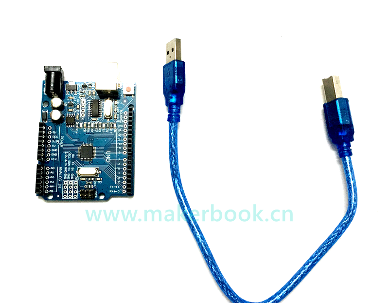
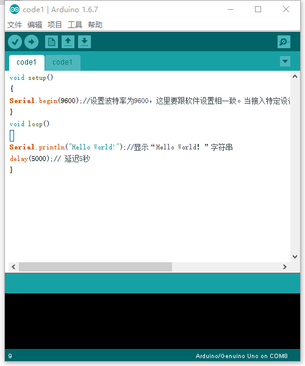
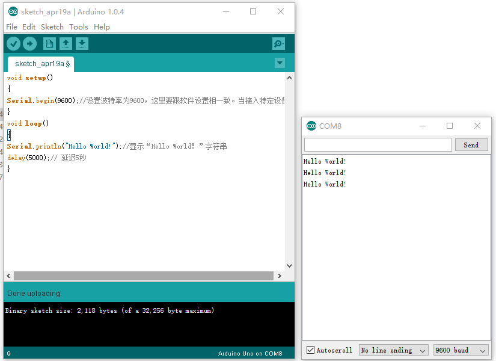

# Hello World！

首先先来练习一个不需要其他辅助元件，只需要一块Arduino和一根下载线的简单实验，让我们的Arduino 说出“Hello World！”，这是一个让Arduino 和PC 机通信的实验，这也是一个入门试验，希望可以带领大家进入Arduino 的世界。
需要的材料：

我们按照上面所讲的将Arduino 的驱动安装好后，我们打开Arduino 的软件，编写一段程序让Arduino 接受到我们发的指令就显示“Hello World！”字符串，当然您也可以让Arduino 不用接受任何指令就直接不断回显“Hello World！”，其实很简单，一条
if（）语句就可以让你的Arduino 听从你的指令了，我们再借用一下Arduino 自带的数字13 口LED，让Arduino 接受到指令时LED 闪烁一下，再显示“Hello World！”
 

### 代码：
[代码下载](http://www.chuang-ke.com/a/downloads/chengxuyuandaima/2016/0419/285.html)

### 效果展示

