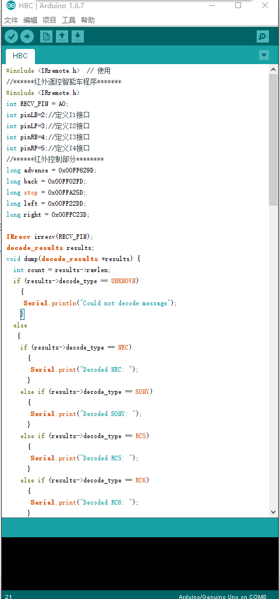

# 红外小车

### 概述
  通过红外线采集实验，获取红外遥控的对应按钮的红外编码，再将对应红外编码在Arduino程序中定义相应的动作，使小车移动。当按下遥控器上对应的按钮，遥控器就会发送对应的编码，通过红外线接收管接收到信号，将对应的代码传递给Arduino，Arduino将向执行对应的动作

### 所用到的知识点
1. Arduino通过L298N电机模块驱动电机
2. 红外线接收
3. 红外线采集

###套件购买
[淘宝购买地址](https://item.taobao.com/item.htm?spm=a1z10.1-c.w137712-11798119558.5.ZWuJNv&id=520731683839)

### 材料
1. arduino uno 开发板
2. L298N电机驱动模块
3. 红外接收头
4. 红外遥控器
5. 电池组+充电器

###基础
* GND 指的是电线接地端的简写。代表地线或0线或负极。
* 5V 代表5v正极
* 3.3v 代表3.3v正极
* IN 输入
* OUT 输出
* +12v 代表12v正极
###视频效果演示
[移步优酷](http://v.youku.com/v_show/id_XMTI4Nzc0NTU5Mg==.html?from=y1.7-2)
### 开始制作
* 第一步，安装亚克力板小车（[图文视频教程](http://www.chuang-ke.com/a/yiqizuochuangke/pinzhuangche/2016/0421/288.html)）
* 第二步，安装Arduino UNO 和L298N等模块到亚克力板小车上。用扎带将电池和arduino板子绑在图示位置。
* 
* 第三步，连线
* 
* 第四部，将红外接收头完全暴露空中，并用扎带绑到杜邦线上，使接收头处于最高位置，获得最佳接收效果。
* 第五部，测试。如果按向前命令，一个马达向前，一个马达向后，把向后的马达两根线正负极调换一下即可。

### 线路连接
1.	电源插入Arduino电源圆形插口
2.	L298n in1-in4 接arduino2-5
3.	L298N GND接线柱连 Arduino GND,L298N 9+接线柱接Arduino 5+
4.	L298N两边各两个接线柱各接一个马达
5.	红外接收头黄色线接Arduino GND，红色线接Arduino 3.3+，蓝色线接Arduino AO

###遥控器操作

遥控器上有很多按钮，我们根据需要定义了5个按钮，分别是前、后、左、右停止。
操作的时候对准红外接收头，用力按按键，小车就会收到相应的命令，并执行。
###如何定义遥控器
首先，我们做了红外线采集实验，获得了对应按钮的编码。

分别是 FFA25D   FF629D  FF22DD  FF02FD   FFC23D

每一个编码要加入0x00前缀写入程序中。
在arduino程序中编码对应如下：
* long advence = 0x00FF629D;
* long back = 0x00FF02FD;
* long stop = 0x00FFA25D;
* long left = 0x00FF22DD;
* long right = 0x00FFC23D;

### 源代码
**[源代码下载](http://www.chuang-ke.com/a/downloads/Arduino/2015/1025/166.html)**（下载需要金币）

###高级玩法
可以用其它任意红外遥控器来操控红外小车，首先就是要做红外线采集实验，然后把采集到的编码替换程序中对应的命令，并将程序重新烧录到arduino板子中，就行了。
### 用到的库
[IRremote ](http://www.chuang-ke.com/a/downloads/Arduinokuxiazai/2015/1025/175.html)

---

## 拓展练习

### 红外代码采集实验
首先要采集遥控器各个按钮的代码，然后记录代码，我们也可以用家用红外遥控器来采集
详情请看：http://bbs.haibucuo.com/thread-45-1-1.html
采集到的代码：
FFA25D   FF629D  
FF22DD  FF02FD   FFC23D

我们要记住每一个按钮对应的编码，后期我们会在程序中定义对应代码对应的功能

写入arduino代码之前，要加上0x00
形成对应的命令：
long advence = 0x00FF629D;
long back = 0x00FF02FD;
long stop = 0x00FFA25D;
long left = 0x00FF22DD;
long right = 0x00FFC23D;

---

### 基础课程

 Arduino代码烧录教程
 Arduino库的导入教程

---

###更新记录
20160511红外小车教程1.0发布