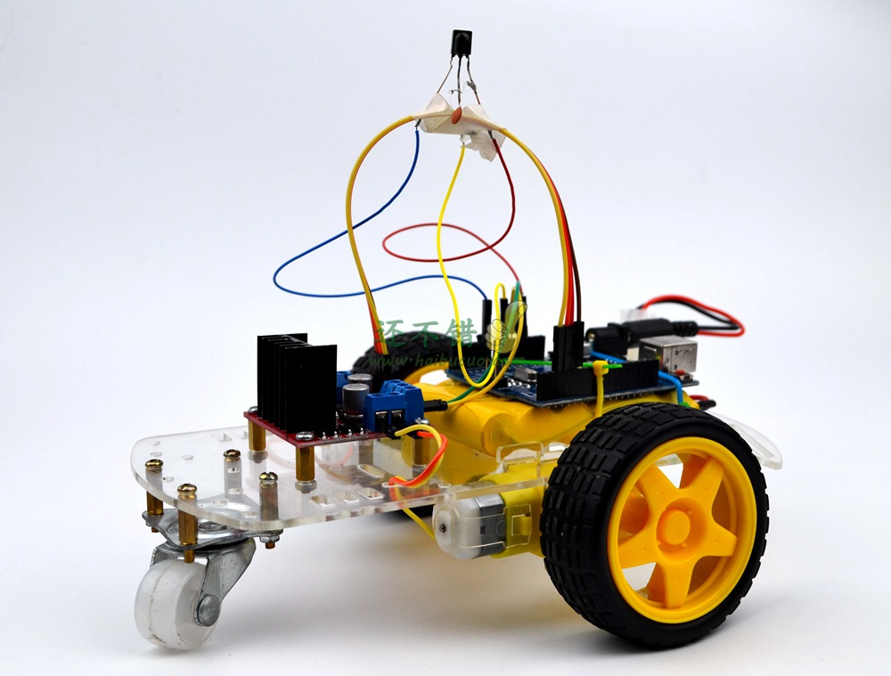
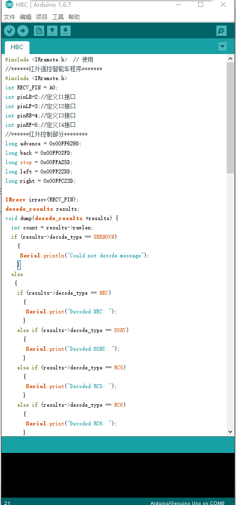

# 红外小车

### 概述
  通过红外线采集实验，获取红外遥控的对应按钮的红外编码，再将对应红外编码在Arduino程序中定义相应的动作，使小车移动。当按下遥控器上对应的按钮，遥控器就会发送对应的编码，通过红外线接收管接收到信号，将对应的代码传递给Arduino，Arduino将向执行对应的动作

### 所用到的知识点
1. Arduino通过L298N电机模块驱动马达
2. 红外线接收
3. 红外线采集
[套件购买地址](https://item.taobao.com/item.htm?spm=a1z10.1-c.w137712-11798119558.5.ZWuJNv&id=520731683839)

### 材料
1. arduino uno 开发板
2. l298n电机驱动模块
3. 红外接收头
4. 红外遥控器
5. 电池组+充电器
### 开始制作
* 第一步，安装亚克力板小车
* 第二步，安装Arduino UNO 和L298N等模块到亚克力板小车上。
* 第三步，连线
* 第四部，测试

### 线路连接
1.	电源插入Arduino电源圆形插口
2.	L298n in1-in4 接arduino2-5
3.	L298N GND接线柱连 Arduino GND,L298N 9+接线柱接Arduino 5+
4.	L298N两边各两个接线柱各接一个马达
5.	红外接收头黄色线接Arduino GND，红色线接Arduino 3.3+，蓝色线接Arduino AO

### 源代码
**[源代码下载](http://www.chuang-ke.com/a/downloads/Arduino/2015/1025/166.html)**

### 用到的库
[IRremote ](http://www.chuang-ke.com/a/downloads/Arduinokuxiazai/2015/1025/175.html)

---

## 拓展练习

### 红外代码采集实验
首先要采集遥控器各个按钮的代码，然后记录代码，我们也可以用家用红外遥控器来采集
详情请看：http://bbs.haibucuo.com/thread-45-1-1.html
采集到的代码：
FFA25D   FF629D  
FF22DD  FF02FD   FFC23D

我们要记住每一个按钮对应的编码，后期我们会在程序中定义对应代码对应的功能

写入arduino代码之前，要加上0x00
形成对应的命令：
long advence = 0x00FF629D;
long back = 0x00FF02FD;
long stop = 0x00FFA25D;
long left = 0x00FF22DD;
long right = 0x00FFC23D;

---

### 基础课程

 Arduino代码烧录教程
 Arduino库的导入教程

