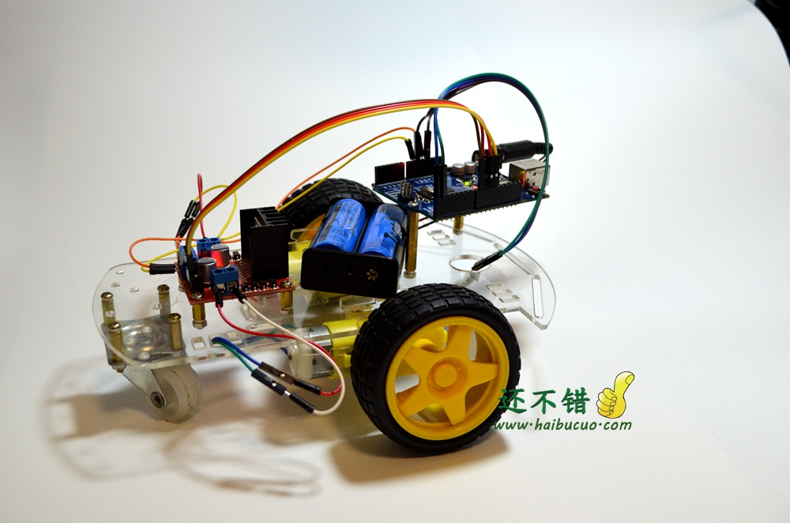
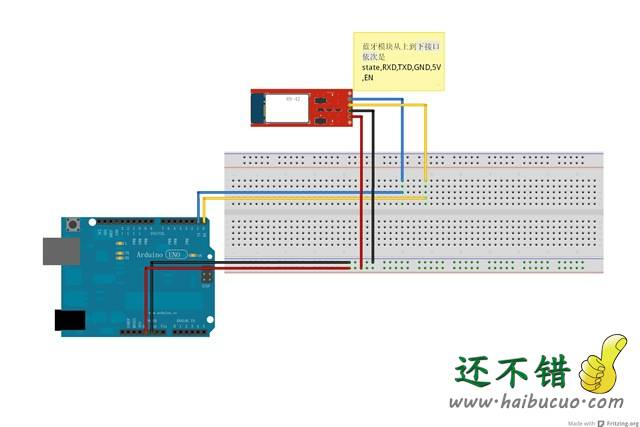
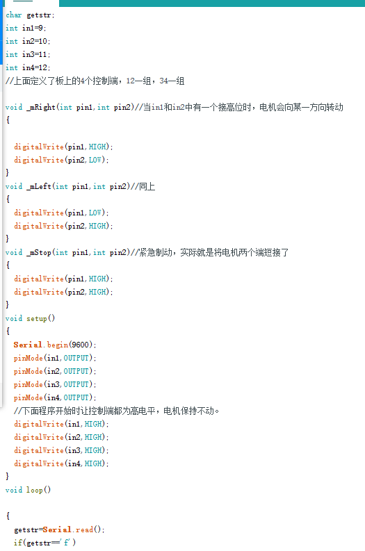
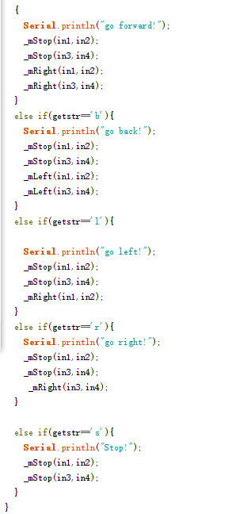

# 蓝牙小车

## 概述

安卓手机通过APP客户端发送指令给蓝牙接收模块，蓝牙模块把命令发送给Arduino UNO,arduino经过事先变好的程序运算，发出指令给L298N电机驱动模块，电机驱动模块驱动电机，实现小车的运动。

## 材料
1. arduino UNO 开发板
2. L298N电机驱动板
3. hc-06蓝牙模块
4. 电池和电池盒
5. 小车底盘或者坦克底盘
6. 导线螺丝若干

### 手机app
[下载地址](http://www.chuang-ke.com/a/downloads/shoujiruanjian/2015/1022/155.html)

只能用于安卓手机
这个软件有几种模式，我们用到的就是2中模式
* 第一，命令模式。 连接蓝牙以后，向小车发送英文字母命令
* 第二，键盘模式，自定义每个按钮的意思和所发送的命令文本

操作方法
F 前进  B后退 L向左转 R向右转
输入f\b\l\r时，无论前往、后退、左转、右转，电机都是先停一下，再转，这样电机都流畅。

## 线路连接
 **蓝牙链接**
 蓝牙上只需要接四条线就行了
 * RX-TX
 * TX-RX
 * VCC-3.3V
 * GND-GND

**L298N接线方法**
* IN1、IN2、IN3、IN4分别连接arduino的9、10、11、12接口
* 5V+接arduino的5V+
* GND接GND
* 12V+接5v+

[操作视频演示](http://v.youku.com/v_show/id_XOTU4ODQ5NjQ4.html)

## 代码
[代码下载](http://www.chuang-ke.com/a/downloads/Arduino/2015/1025/167.html)

---

## 拓展练习

### 蓝牙模块测试实验
请移步http://bbs.haibucuo.com/forum.php?mod=viewthread&tid=63&highlight=%C0%B6%D1%C0

