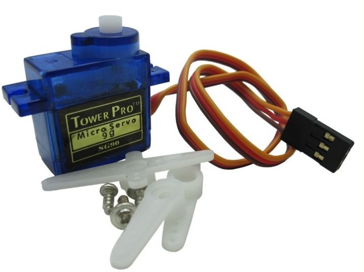
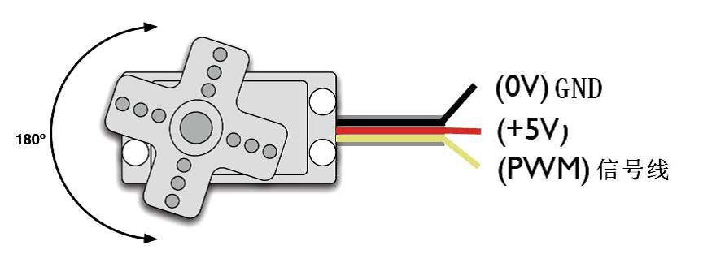
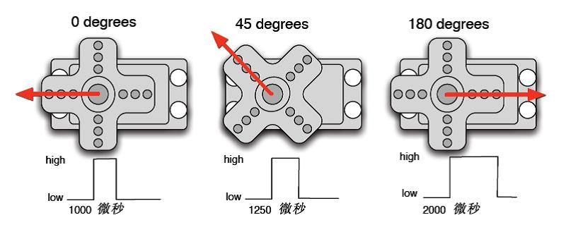
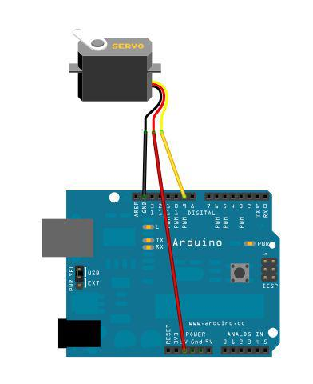
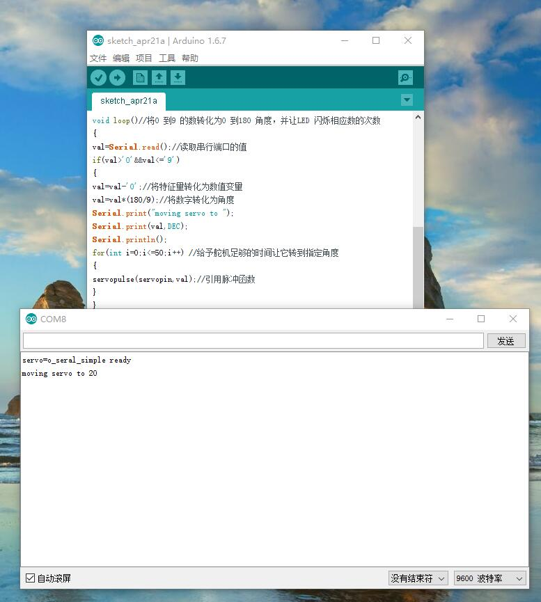

# 例18-舵机控制实验

### 概述
  舵机是一种位置伺服的驱动器，主要是由外壳、电路板、无核心马达、齿轮与位置检测器所构成。其工作原理是由接收机或者单片机发出信号给舵机，其内部有一个基准电路，产生周期为20ms，宽度为1.5ms 的基准信号，将获得的直流偏置电压与电位器的电压比较，获得电压差输出。经由电路板上的IC 判断转动方向，再驱动无核心马达开始转动，透过减速齿轮将动力传至摆臂，同时由位置检测器送回信号，判断是否已经到达定位。适用于那些需要角度不断变化并可以保持的控制系统。当电机转速一定时，通过级联减速齿轮带动电位器旋转，使得电压差为0，电机停止转动。一般舵机旋转的角度范围是0 度到180 度。



舵机有很多规格，但所有的舵机都有外接三根线，分别用`棕`、`红`、`橙`三种颜色进行区分，由于舵机品牌不同，颜色也会有所差异，`棕`色为接地线，`红`色为电源正极线，`橙`色为信号线。

舵机的转动的角度是通过调节PWM（脉冲宽度调制）信号的占空比来实现的，标准PWM（脉冲宽度调制）信号的周期固定为20ms（50Hz），理论上脉宽分布应在1ms到2ms 之间，但是，事实上脉宽可由0.5ms 到2.5ms 之间，脉宽和舵机的转角0°～180°相对应。有一点值得注意的地方，由于舵机牌子不同，对于同一信号，不同牌子的舵机旋转的角度也会有所不同。

## 实践1
了解了基础知识以后我们就可以来学习控制一个舵机了，本实验所需要的元器件很少只需要舵机一个、跳线一扎就可以了。
###材料
1. 舵机一个
2. 杜邦线若干

###接线示意图


`将舵机接数字 9 接口上`
###编程
编写一个程序让舵机转动到用户输入数字所对应的角度数的位置，并将角度打印显示到屏幕上。

参考源程序A：
```
int servopin=9;//定义数字接口9 连接伺服舵机信号线
int myangle;//定义角度变量
int pulsewidth;//定义脉宽变量
int val;
void servopulse(int servopin,int myangle)//定义一个脉冲函数
{
pulsewidth=(myangle*11)+500;//将角度转化为500-2480 的脉宽值
digitalWrite(servopin,HIGH);//将舵机接口电平至高
delayMicroseconds(pulsewidth);//延时脉宽值的微秒数
digitalWrite(servopin,LOW);//将舵机接口电平至低
delay(20-pulsewidth/1000);
}
void setup()
{
pinMode(servopin,OUTPUT);//设定舵机接口为输出接口
Serial.begin(9600);//连接到串行端口，波特率为9600
Serial.println("servo=o_seral_simple ready" ) ;
}
void loop()//将0 到9 的数转化为0 到180 角度，并让LED 闪烁相应数的次数
{
val=Serial.read();//读取串行端口的值
if(val>'0'&&val<='9')
{
val=val-'0';//将特征量转化为数值变量
val=val*(180/9);//将数字转化为角度
Serial.print("moving servo to ");
Serial.print(val,DEC);
Serial.println();
for(int i=0;i<=50;i++) //给予舵机足够的时间让它转到指定角度
{
servopulse(servopin,val);//引用脉冲函数
}
}
}
```
###效果展示
接上线，打开Arduino`串口监视器`,shuru 0 到9的任意数值，系统将会转化为0 到180 角度，并让LED 闪烁相应数的次数。

##实践2
先具体分析一下 Arduino 自带的Servo 函数及其语句，来介绍一下舵机函数的几个常用语句吧。
1. 1 attach（接口）——设定舵机的接口，只有数字9 或10 接口可利用。
2. 2 write（角度）——用于设定舵机旋转角度的语句，可设定的角度范围是0°到180°。
3. 3 read（）——用于读取舵机角度的语句，可理解为读取最后一条write()命令中
的值。
4. 4 attached（）——判断舵机参数是否已发送到舵机所在接口。
5. 5 detach（）——使舵机与其接口分离，该接口（数字9 或10 接口）可继续被用作PWM 接口。
注：`以上语句的书写格式均为“舵机变量名.具体语句（）”例如：myservo.attach(9)。
仍然将舵机接在数字9 接口上即可。`


### 参考源程序B：

```
#include <Servo.h>//定义头文件，这里有一点要注意，可以直接在Arduino 软件菜单栏单击Sketch>Importlibrary>Servo,调用Servo 函数，也可以直接输入#include <Servo.h>，但是在输入时要注意在#include 与<Servo.h>之间要有空格，否则编译时会报错。
Servo myservo;//定义舵机变量名
void setup()
{
myservo.attach(9);//定义舵机接口（9、10 都可以，缺点只能控制2 个）
}
void loop()
{
myservo.write(90);//设置舵机旋转的角度
}
```
以上就是控制舵机的两种方法，各有优缺点大家根据自己的喜好和需要进行选择。
