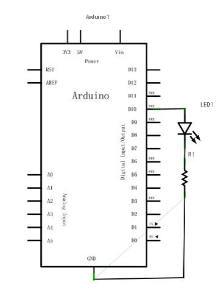
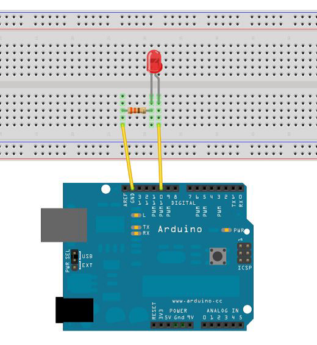
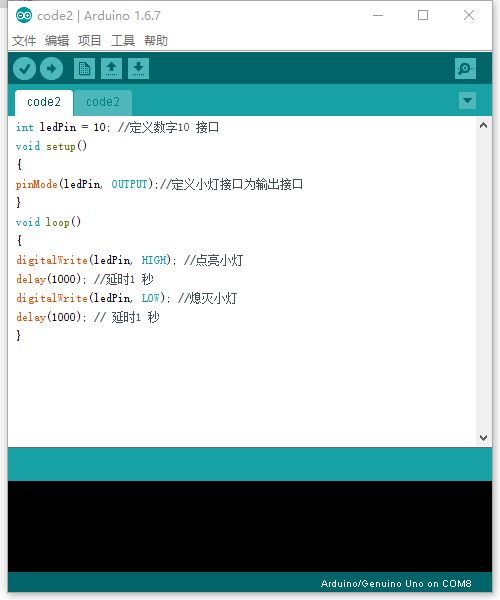

# 例2-LED 闪烁

LED 小灯实验是比较基础的实验之一，上一个“ Hello World！”实验里已经利用到了Arduino 自带的LED，这次我们利用其他I/O 口和外接直插LED 灯来完成这个实验，我们需要的实验器材除了每个实验都必须的Arduino 控制器和USB 下载线以外的

### 材料
1. 红色M5 直插LED*1 
2. 220Ω直插电阻*1
3. 面包板*1
4. 面包板跳线*1 扎

### 原理图

下一步我们按照下面的小灯实验原理图链接实物图，这里我们使用数字10 接口。使用发光二极管LED 时，要连接限流电阻，这里为220Ω电阻，否则电流过大会烧毁发光二极管。
小灯实验原理图

### 实物图

### 效果

按照上图链接好电路后，就可以开始编写程序了，我们还是让LED 小灯闪烁，点亮1 秒熄灭1 秒。这个程序很简单与Arduino 自带的例程里的Blink 相似只是将13 数字接口换做10 数字接口。

### 参考源码
[源码下载](http://www.chuang-ke.com/a/kaiyuanyingjian/Arduino/2016/0419/286.html)

---

未完待续。。