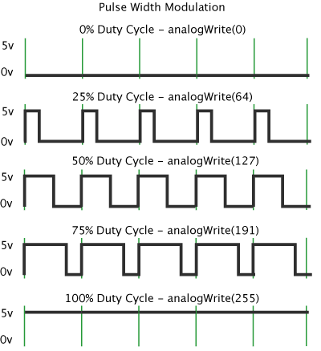

# PWM脉冲宽度调制

Pulse Width Modulation, or PWM, is a technique for getting analog results with digital means. Digital control is used to create a square wave, a signal switched between on and off. This on-off pattern can simulate voltages in between full on (5 Volts) and off (0 Volts) by changing the portion of the time the signal spends on versus the time that the signal spends off. The duration of "on time" is called the pulse width. To get varying analog values, you change, or modulate, that pulse width. If you repeat this on-off pattern fast enough with an LED for example, the result is as if the signal is a steady voltage between 0 and 5v controlling the brightness of the LED.

脉冲宽度调制或PWM，是通过数字均值获得模拟结果的技术。数字控制被用来创建一个方波，信号在开和关之间切换。这种开关模式通过改变“开”时间段和“关”时间段的比值完全模拟从开（5伏特）和关（0伏特）之间的电压。“开时间“的周期称为脉冲宽度。为了得到不同的模拟值，你可以更改，或调节脉冲宽度。如果你重复这种开关模式速度足够快，其结果是一个介于0和5V之间的稳定电压用以控制LED的亮度。

In the graphic below, the green lines represent a regular time period. This duration or period is the inverse of the PWM frequency. In other words, with Arduino's PWM frequency at about 500Hz, the green lines would measure 2 milliseconds each. A call to [analogWrite](http://arduino.cc/en/Reference/AnalogWrite)() is on a scale of 0 - 255, such that analogWrite(255) requests a 100% duty cycle (always on), and analogWrite(127) is a 50% duty cycle (on half the time) for example.

下图中，绿色线表示一个固定的时间期限。此持续时间或周期是PWM的频率的倒数。换言之，Arduino的PWM频率约为500Hz，每个绿线之间表示2毫秒。一个analogWrite（）的调用区间为0- 255，例如analogWrite（255）需要100％占空比（常开），和analogWrite（127）是50％占空比（上一半的时间）。

Once you get this example running, grab your arduino and shake it back and forth. What you are doing here is essentially mapping time across the space. To our eyes, the movement blurs each LED blink into a line. As the LED fades in and out, those little lines will grow and shrink in length. Now you are seeing the pulse width.

一旦你运行这个例子中，抓住你的Arduino来回摇晃。你这么做的实质上是时间跨越时空的映射。对我们的眼睛，每个运动模糊成一条线的LED闪烁。由于LED消失和缩小，那些小行的长度会增长和收缩。现在你就可以看到脉冲宽度。