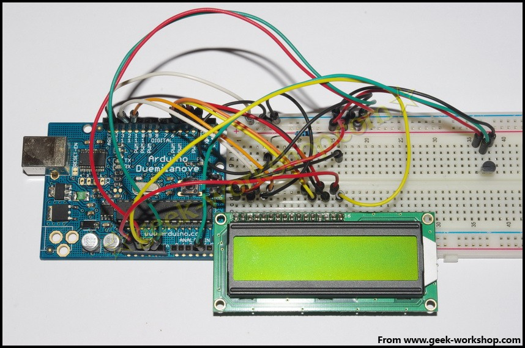

# 实验的效果如下[http://player.youku.com/player.php/sid/XMjg1MDE1MjA4/v.swf](http://player.youku.com/player.php/sid/XMjg1MDE1MjA4/v.swf) {#http-player-youku-com-player-php-sid-xmjg1mde1mja4-v-swf}

arduino学习笔记22光控LED实验

光敏电阻又称光导管，常用的制作材料为硫化镉，另外还有硒、硫化铝、硫化铅和硫化铋等材料。这些制作材料具有在特定波长的光照下，其阻值迅速减小的特性。这是由于光照产生的载流子都参与导电，在外加电场的作用下漂移运动，从而使光敏电阻的阻值迅速下降。光敏电阻的工作原理基于内光电效应。在半导体光敏材料的两端装上电极引线，将其封装在带有透明窗的管壳里就构成光敏电阻，为了增加灵敏度，两电极常做成梳状。在有光照射时，射入的光强，电阻减小，射入的光弱，电阻增大。下图就是一个光敏电阻 本次实验设计的效果是，当光照正常的时候led灯是灭的，当周围变暗时led灯变亮。因为光敏电阻受不同光照影响变化很大，所以本次实验的参数是在60W三基色节能灯照射下实验（无日光照射），同样亮度的日光下光敏电阻的阻值会比日光灯下低不少，估计和不同光的波段有关系。不同环境下实验使用的参数不同，大家根据原理进行调整。实验前先测量一下当前环境下光敏电阻的亮阻值与暗阻值下图是测出来的LED亮阻值，为9.1KΩ 下图是测出来的LED暗阻值，为32.4KΩ 硬件连接图如下  根据测出来的亮阻9.1KΩ，暗阻32.4欧姆。选定分压电阻为10KΩ。因为当有遮挡物的后，阻值会变大。假设亮阻为10KΩ（对于光敏电阻来说，与测量出来的9.1KΩ差别不大，计算起来更加方便了），分压阻值为10K欧姆。模拟2号口所测量的触发电压为10KΩ分压电阻的，在5V电源供电下，亮与暗转换的触发电压为5×10÷（10+10）=2.5V。当光线越暗，光敏电阻的阻值也就越大，分压两端电压也就越小。所以触发条件就为≤2.5V。（不同光照条件下触发电压不同，请根据实验环境进行调整。）程序代码如下

1.  int photocellPin = 2;    //定义变量photocellsh=2，为电压读取端口。
2.  int ledPin = 12;   //定义变量ledPin=12，为led电平输出端口
3.  int val = 0;       //定义val变量的起始值
4.  void setup() { 
5.  pinMode(ledPin, OUTPUT);  //使ledPin为输出模式
6.  } 
7.  void loop() { 
8.  val = analogRead(photocellPin);    //从传感器读取值
9.  if(val<=512){      //512=2.5V，想让传感器敏感一些的时候，把数值调高，想让传感器迟钝的时候把数值调低。
10.  digitalWrite(ledPin, HIGH); //当val小于512(2.5V)的时候，led亮。
11.  }
12.  else{
13.  digitalWrite(ledPin, LOW);
14.  }
15.  }

复制代码

实验效果如下[http://player.youku.com/player.php/sid/XMjg1MzAxMDUy/v.swf](http://player.youku.com/player.php/sid/XMjg1MzAxMDUy/v.swf)

arduino学习笔记23 1602液晶实验

本次试验使用arduino直接驱动1602液晶显示文字1602液晶在应用中非常广泛，最初的1602液晶使用的是HD44780控制器，现在各个厂家的1602模块基本上都是采用了与之兼容的IC，所以特性上基本都是一致的。**1602LCD主要技术参数**显示容量为16×2个字符；芯片工作电压为4.5～5.5V；工作电流为2.0mA（5.0V）；模块最佳工作电压为5.0V；字符尺寸为2.95×4.35（W×H）mm。**1602液晶接口引脚定义** **接口说明：**1、两组电源 一组是模块的电源 一组是背光板的电源 一般均使用5V供电。本次试验背光使用3.3V供电也可以工作。2、VL是调节对比度的引脚，串联不大于5KΩ的电位器进行调节。本次实验使用1KΩ的电阻来设定对比度。其连接分高电位与低电位接法，本次使用低电位接法，串联1KΩ电阻后接GND。3、RS 是很多液晶上都有的引脚 是命令/数据选择引脚 该脚电平为高时表示将进行数据操作；为低时表示进行命令操作。4、RW 也是很多液晶上都有的引脚 是读写选择端 该脚电平为高是表示要对液晶进行读操作；为低时表示要进行写操作。5、E 同样很多液晶模块有此引脚 通常在总线上信号稳定后给一正脉冲通知把数据读走，在此脚为高电平的时候总线不允许变化。6、D0—D7 8 位双向并行总线，用来传送命令和数据。7、BLA是背光源正极，BLK是背光源负极。**1602液晶的基本操作分以下四种：** 下图就是1602液晶实物图  1602直接与arduino通信，根据产品手册描述，分8位连接法与4位连接法，咱们先使用8位连接法进行实验。硬件连接方式如下图  代码如下

1.  int DI = 12;
2.  int RW = 11;
3.  int DB[] = {3, 4, 5, 6, 7, 8, 9, 10};//使用数组来定义总线需要的管脚
4.  int Enable = 2;
5.  void LcdCommandWrite(int value) {
6.  // 定义所有引脚
7.  int i = 0;
8.  for (i=DB[0]; i <= DI; i++) //总线赋值
9.  {
10.  digitalWrite(i,value & 01);//因为1602液晶信号识别是D7-D0(不是D0-D7)，这里是用来反转信号。
11.  value >>= 1;
12.  }
13.  digitalWrite(Enable,LOW);
14.  delayMicroseconds(1);
15.  digitalWrite(Enable,HIGH);
16.  delayMicroseconds(1);  // 延时1ms
17.  digitalWrite(Enable,LOW);
18.  delayMicroseconds(1);  // 延时1ms
19.  }
20.  void LcdDataWrite(int value) {
21.  // 定义所有引脚
22.  int i = 0;
23.  digitalWrite(DI, HIGH);
24.  digitalWrite(RW, LOW);
25.  for (i=DB[0]; i <= DB[7]; i++) {
26.  digitalWrite(i,value & 01);
27.  value >>= 1;
28.  }
29.  digitalWrite(Enable,LOW);
30.  delayMicroseconds(1);
31.  digitalWrite(Enable,HIGH);
32.  delayMicroseconds(1);
33.  digitalWrite(Enable,LOW);
34.  delayMicroseconds(1);  // 延时1ms
35.  }
36.  void setup (void) {
37.  int i = 0;
38.  for (i=Enable; i <= DI; i++) {
39.  pinMode(i,OUTPUT);
40.  }
41.  delay(100);
42.  // 短暂的停顿后初始化LCD
43.  // 用于LCD控制需要
44.  LcdCommandWrite(0x38);  // 设置为8-bit接口，2行显示，5x7文字大小                     
45.  delay(64);                      
46.  LcdCommandWrite(0x38);  // 设置为8-bit接口，2行显示，5x7文字大小                        
47.  delay(50);                      
48.  LcdCommandWrite(0x38);  // 设置为8-bit接口，2行显示，5x7文字大小                        
49.  delay(20);                      
50.  LcdCommandWrite(0x06);  // 输入方式设定
51.  // 自动增量，没有显示移位
52.  delay(20);                      
53.  LcdCommandWrite(0x0E);  // 显示设置
54.  // 开启显示屏，光标显示，无闪烁
55.  delay(20);                      
56.  LcdCommandWrite(0x01);  // 屏幕清空，光标位置归零  
57.  delay(100);                      
58.  LcdCommandWrite(0x80);  // 显示设置
59.  // 开启显示屏，光标显示，无闪烁
60.  delay(20);                      
61.  }
62.  void loop (void) {
63.  LcdCommandWrite(0x01);  // 屏幕清空，光标位置归零  
64.  delay(10); 
65.  LcdCommandWrite(0x80+3); 
66.  delay(10);                     
67.  // 写入欢迎信息 
68.  LcdDataWrite('W');
69.  LcdDataWrite('e');
70.  LcdDataWrite('l');
71.  LcdDataWrite('c');
72.  LcdDataWrite('o');
73.  LcdDataWrite('m');
74.  LcdDataWrite('e');
75.  LcdDataWrite(' ');
76.  LcdDataWrite('t');
77.  LcdDataWrite('o');
78.  delay(10);
79.  LcdCommandWrite(0xc0+1);  // 定义光标位置为第二行第二个位置  
80.  delay(10); 
81.  LcdDataWrite('g');
82.  LcdDataWrite('e');
83.  LcdDataWrite('e');
84.  LcdDataWrite('k');
85.  LcdDataWrite('-');
86.  LcdDataWrite('w');
87.  LcdDataWrite('o');
88.  LcdDataWrite('r');
89.  LcdDataWrite('k');
90.  LcdDataWrite('s');
91.  LcdDataWrite('h');
92.  LcdDataWrite('o');
93.  LcdDataWrite('p');
94.  delay(5000);
95.  LcdCommandWrite(0x01);  // 屏幕清空，光标位置归零  
96.  delay(10);
97.  LcdDataWrite('I');
98.  LcdDataWrite(' ');
99.  LcdDataWrite('a');
100.  LcdDataWrite('m');
101.  LcdDataWrite(' ');
102.  LcdDataWrite('h');
103.  LcdDataWrite('o');
104.  LcdDataWrite('n');
105.  LcdDataWrite('g');
106.  LcdDataWrite('y');
107.  LcdDataWrite('i');
108.  delay(3000);
109.  LcdCommandWrite(0x02); //设置模式为新文字替换老文字，无新文字的地方显示不变。
110.  delay(10);
111.  LcdCommandWrite(0x80+5); //定义光标位置为第一行第六个位置
112.  delay(10);  
113.  LcdDataWrite('t');
114.  LcdDataWrite('h');
115.  LcdDataWrite('e');
116.  LcdDataWrite(' ');
117.  LcdDataWrite('a');
118.  LcdDataWrite('d');
119.  LcdDataWrite('m');
120.  LcdDataWrite('i');
121.  LcdDataWrite('n');
122.  delay(5000);
123.  }

复制代码

实验效果如下[http://player.youku.com/player.php/sid/XMjg2NTkxODY0/v.swf](http://player.youku.com/player.php/sid/XMjg2NTkxODY0/v.swf)**4位接法**在正常使用下，8位接法基本把arduino的数字端口占满了，如果想要多接几个传感器就没有端口了，这种情况下怎么处理呢，咱们可以使用4位接法。4位接法的硬件连接方法如下图  硬件接好后把下面的代码上传到控制板上，看看效果。

1.  int LCD1602_RS=12;   
2.  int LCD1602_RW=11;   
3.  int LCD1602_EN=10;   
4.  int DB[] = { 6, 7, 8, 9};
5.  char str1[]="Welcome to";
6.  char str2[]="geek-workshop";
7.  char str3[]="this is the";
8.  char str4[]="4-bit interface";
9.  void LCD_Command_Write(int command)
10.  {
11.  int i,temp;
12.  digitalWrite( LCD1602_RS,LOW);
13.  digitalWrite( LCD1602_RW,LOW);
14.  digitalWrite( LCD1602_EN,LOW);
15.  temp=command & 0xf0;
16.  for (i=DB[0]; i <= 9; i++)
17.  {
18.  digitalWrite(i,temp & 0x80);
19.  temp <<= 1;
20.  }
21.  digitalWrite( LCD1602_EN,HIGH);
22.  delayMicroseconds(1);
23.  digitalWrite( LCD1602_EN,LOW);
24.  temp=(command & 0x0f)<<4;
25.  for (i=DB[0]; i <= 10; i++)
26.  {
27.  digitalWrite(i,temp & 0x80);
28.  temp <<= 1;
29.  }
30.  digitalWrite( LCD1602_EN,HIGH);
31.  delayMicroseconds(1); 
32.  digitalWrite( LCD1602_EN,LOW);
33.  }
34.  void LCD_Data_Write(int dat)
35.  {
36.  int i=0,temp;
37.  digitalWrite( LCD1602_RS,HIGH);
38.  digitalWrite( LCD1602_RW,LOW);
39.  digitalWrite( LCD1602_EN,LOW);
40.  temp=dat & 0xf0;
41.  for (i=DB[0]; i <= 9; i++)
42.  {
43.  digitalWrite(i,temp & 0x80);
44.  temp <<= 1;
45.  }
46.  digitalWrite( LCD1602_EN,HIGH);
47.  delayMicroseconds(1);
48.  digitalWrite( LCD1602_EN,LOW);
49.  temp=(dat & 0x0f)<<4;
50.  for (i=DB[0]; i <= 10; i++)
51.  {
52.  digitalWrite(i,temp & 0x80);
53.  temp <<= 1;
54.  }
55.  digitalWrite( LCD1602_EN,HIGH);
56.  delayMicroseconds(1); 
57.  digitalWrite( LCD1602_EN,LOW);
58.  }
59.  void LCD_SET_XY( int x, int y )
60.  {
61.  int address;
62.  if (y ==0)    address = 0x80 + x;
63.  else          address = 0xC0 + x;
64.  LCD_Command_Write(address); 
65.  }
66.  void LCD_Write_Char( int x,int y,int dat)
67.  {
68.  LCD_SET_XY( x, y ); 
69.  LCD_Data_Write(dat);
70.  }
71.  void LCD_Write_String(int X,int Y,char *s)
72.  {
73.  LCD_SET_XY( X, Y );    //设置地址 
74.  while (*s)             //写字符串
75.  {
76.  LCD_Data_Write(*s);   
77.  s ++;
78.  }
79.  }
80.  void setup (void) 
81.  {
82.  int i = 0;
83.  for (i=6; i <= 12; i++) 
84.  {
85.  pinMode(i,OUTPUT);
86.  }
87.  delay(100);
88.  LCD_Command_Write(0x28);//4线 2行 5x7
89.  delay(50); 
90.  LCD_Command_Write(0x06);
91.  delay(50); 
92.  LCD_Command_Write(0x0c);
93.  delay(50); 
94.  LCD_Command_Write(0x80);
95.  delay(50); 
96.  LCD_Command_Write(0x01);
97.  delay(50); 
98.  }
99.  void loop (void)
100.  {
101.  LCD_Command_Write(0x01);
102.  delay(50);
103.  LCD_Write_String(3,0,str1);//第1行，第4个地址起
104.  delay(50);
105.  LCD_Write_String(1,1,str2);//第2行，第2个地址起
106.  delay(5000);
107.  LCD_Command_Write(0x01);
108.  delay(50);
109.  LCD_Write_String(0,0,str3);
110.  delay(50);
111.  LCD_Write_String(0,1,str4);
112.  delay(5000);
113.  
114.  }

复制代码

4位接法实验效果如下[http://player.youku.com/player.php/sid/XMjg3MDE5MDIw/v.swf](http://player.youku.com/player.php/sid/XMjg3MDE5MDIw/v.swf)这里我们讲解一下最关键的部分，就是LCD的控制命令。在上面两段代码中，我们常常可以遇到0x01,0x38这种参数。这些参数代表什么呢？在C/C++语言中，0x38代表的是十六进制的数值"38"，"0x"的意思就是十六进制。先打开win7下的计算器，选择“程序员”“基本”， 然后咱们选择“十六进制”，输入“38”， 然后再点击“二进制”。这时十六进制的“38”就会转换为二进制下的数值“111000”。 以8位控制法接LCD是，对应的控制信息就是“00111000” 同理，也可以把二进制的控制信息，逆运算为十六进制的。有的产品说明书写的控制命令是"38H"这里说明一下，一般情况下十六进制 前缀0x 后缀h  十进制 后缀D八进制 后缀Q二进制 后缀B但是不同的程序语言，对于十六进制的表达方式不完全相同，在arduino下，表达十六进制数值“38”只能使用“0x38”而不能用“38H”最后放三个附件，是三个不同厂家的1602 LCD手册，供大家深入研究。 [1602手册.pdf](http://www.geek-workshop.com/forum.php?mod=attachment&aid=OTIwfGVhNmM3NjAyfDEzMTE5MjI4MjV8MHw3OA%3D%3D) (634.17 KB, 下载次数: 3)  [1602.pdf](http://www.geek-workshop.com/forum.php?mod=attachment&aid=OTE5fDU0ODU2MGFmfDEzMTE5MjI4MjV8MHw3OA%3D%3D) (233 KB, 下载次数: 1)  [SMC1602A.pdf](http://www.geek-workshop.com/forum.php?mod=attachment&aid=OTI1fDk1ZTVjMzEzfDEzMTE5MjI4MjV8MHw3OA%3D%3D) (255.88 KB, 下载次数: 1) 

arduino学习笔记24温度传感器实验

通过上一次的实验，我们学会了1602液晶的使用。下面我们做一个简单的温度传感器，通过一个LM35温度传感器读取室温后，使温度显示在1602液晶屏幕上。上次我们驱动液晶是使用的手工编写代码，这次我们直接使用arduino自带的LiquidCrystal库来进行驱动，此库文件允许arduino控制板控制基于Hitachi HD44780或与之相兼容芯片大部分的液晶，可以工作于4bit或者8bit状态。下图为我们所使用的arduino的LiquidCrystal库文件位置，只有这里显示的库文件，arduino才可以调用。 **什么是温度传感器？**温度传感器就是利用物质随温度变化特性的规律，把温度转换为电量的传感器。按照测量方式可以分为接触式和非接触式两大类，按照传感器材料以及元件特性分为热电阻传感器和热电偶传感器两类。白光烙铁头使用的是热电偶传感器，本次试验使用的LM35是热电阻传感器。LM35温度传感器实物如下图： LM35使用非常普遍，他使用内部补偿机制，输出可以从0℃开始。封装为T0992，工作电压4—30V。而且在上述电压范围内，芯片的工作电流不超过60ua。根据产品使用手册，得知LM35传感器的输出电压与摄氏温度呈线性关系，0℃时输出为0V，每升高1℃，输出电压增加10mv。下图为实验硬件连接方式  代码如下

1.  #include <LiquidCrystal.h>   //调用arduino自带的LiquidCrystal库
2.  LiquidCrystal lcd(12, 11, 5, 4, 3, 2);//设置接口
3.  int potPin = 4;                     //设置模拟口4为LM35的信号输入端口
4.  float temperature = 0;                //设置temperature为浮点变量
5.  long val=0;                       //设置val为长整数变量
6.  void setup()
7.  {
8.  lcd.begin(16, 2);  //初始化LCD
9.  lcd.print("LM35 Thermometer");  //使屏幕显示文字LM35 Thermometer
10.  delay(1000); //延时1000ms
11.  }
12.  void loop ()                     
13.  {
14.  val = analogRead(potPin);             //val变量为从LM35信号口读取到的数值
15.  temperature = ((val+1)*0.0048828125*1000);         //把读取到的val转换为温度数值的10倍
16.  lcd.clear(); //清屏
17.  lcd.print("LM35 Thermometer"); //使屏幕显示文字LM35 Thermometer
18.  lcd.setCursor(0, 1) ; //设置光标位置为第二行第一个位置
19.  lcd.print((long)temperature / 10);   //显示温度整数位
20.  lcd.print(".");    //显示小数点
21.  lcd.print( (long)temperature % 10); //显示温度小数点后一位
22.  lcd.print((char)223); //显示o符号
23.  lcd.print("C"); //显示字母C
24.  delay(2000);                     //延时2秒，这里也就是刷新速度。
25.  }                        

复制代码

实验效果如下，为了使温度发生变化，用一个装了热水的塑料杯，放在传感器旁边。[http://player.youku.com/player.php/sid/XMjg3NjYyMjI0/v.swf](http://player.youku.com/player.php/sid/XMjg3NjYyMjI0/v.swf)关于LiquidCrystal库使用的更详细方法，请查看arduino官方介绍。[http://arduino.cc/en/Reference/LiquidCrystal](http://arduino.cc/en/Reference/LiquidCrystal)附件为LM35的产品说明书 [LM35产品说明书.pdf](http://www.geek-workshop.com/forum.php?mod=attachment&aid=OTg2fGRlZjFlOTVkfDEzMTE5MjI4ODd8MHw3OQ%3D%3D) (303.72 KB, 下载次数: 0) 

arduino学习笔记25 ADXL345加速度传感器实验

前两天我们做了温度传感器实验，大家一定还有印象。今天我们来研究另外一种传感器加速度传感器。**什么是加速度传感器**加速度传感器，作用是测量在加速过程中产生的力。最基本的如咱们平常所熟悉的是重力加速度，大小是1g。**加速度传感器一般用于什么地方**通过测量由重力引起的加速度，你可以计算出设备相对于水平面的倾斜角度。通过分析动态加速度，你可以分析出设备的移动方式。自平衡车中就是使用加速度传感器与陀螺仪进行卡尔曼滤波进行姿态矫正。本次试验使用的ADXL345数字传感器，通过I2C或者SPI接口直接输出数字信号。在1g的加速度下，输出数值为256.

2011-7-28 22:56:15 上传

[**下载附件** (24.89 KB)](http://www.geek-workshop.com/forum.php?mod=attachment&aid=OTg3fGEyNGQzNzVifDEzMTI2MTk1Nzh8MHw4MA%3D%3D&nothumb=yes)

下面是硬件连接图

2011-7-29 22:16:48 上传

[**下载附件** (112.73 KB)](http://www.geek-workshop.com/forum.php?mod=attachment&aid=OTkxfDNiNDU0Zjg2fDEzMTI2MTk1Nzh8MHw4MA%3D%3D&nothumb=yes)

2011-7-29 15:58:16 上传

[**下载附件** (164.15 KB)](http://www.geek-workshop.com/forum.php?mod=attachment&aid=OTg5fDQ4ODY4MGU1fDEzMTI2MTk1Nzh8MHw4MA%3D%3D&nothumb=yes)

2011-7-28 22:56:16 上传

[**下载附件** (203.65 KB)](http://www.geek-workshop.com/forum.php?mod=attachment&aid=OTg4fDlmOGZlYWEwfDEzMTI2MTk1Nzh8MHw4MA%3D%3D&nothumb=yes)

下面是代码

1.  #include <Wire.h>  //调用arduino自带的I2C库
2.  #include <LiquidCrystal.h>   //调用arduino自带的LiquidCrystal库
3.  #define Register_ID 0
4.  #define Register_2D 0x2D
5.  #define Register_X0 0x32
6.  #define Register_X1 0x33
7.  #define Register_Y0 0x34
8.  #define Register_Y1 0x35
9.  #define Register_Z0 0x36
10.  #define Register_Z1 0x37
11.  LiquidCrystal lcd(12, 11, 10, 9, 8, 7);//设置接口
12.  int ADXAddress = 0xA7>>1;  //转换为7位地址
13.  int reading = 0;
14.  int val = 0;
15.  int X0,X1,X_out;
16.  int Y0,Y1,Y_out;
17.  int Z1,Z0,Z_out;
18.  double Xg,Yg,Zg;
19.  void setup()
20.  {
21.  lcd.begin(16, 2);  //初始化LCD
22.  delay(100);
23.  Wire.begin();  //初始化I2C
24.  delay(100);
25.  Wire.beginTransmission(ADXAddress);
26.  Wire.send(Register_2D);
27.  Wire.send(8);
28.  Wire.endTransmission();
29.  }
30.  void loop()
31.  {
32.  Wire.beginTransmission(ADXAddress);
33.  Wire.send(Register_X0);
34.  Wire.send(Register_X1);
35.  Wire.endTransmission();
36.  Wire.requestFrom(ADXAddress,2);
37.  if(Wire.available()<=2);
38.  {
39.  X0 = Wire.receive();
40.  X1 = Wire.receive();
41.  X1 = X1<<8;
42.  X_out = X0+X1;
43.  }
44.  
45.  Wire.beginTransmission(ADXAddress);
46.  Wire.send(Register_Y0);
47.  Wire.send(Register_Y1);
48.  Wire.endTransmission();
49.  Wire.requestFrom(ADXAddress,2);
50.  if(Wire.available()<=2);
51.  {
52.  Y0 = Wire.receive();
53.  Y1 = Wire.receive();
54.  Y1 = Y1<<8;
55.  Y_out = Y0+Y1;
56.  }
57.  
58.  Wire.beginTransmission(ADXAddress);
59.  Wire.send(Register_Z0);
60.  Wire.send(Register_Z1);
61.  Wire.endTransmission();
62.  Wire.requestFrom(ADXAddress,2);
63.  if(Wire.available()<=2);
64.  {
65.  Z0 = Wire.receive();
66.  Z1 = Wire.receive();
67.  Z1 = Y1<<8;
68.  Z_out = Y0+Y1;
69.  }
70.  
71.  Xg = X_out/256.00;//把输出结果转换为重力加速度g,精确到小数点后2位。
72.  Yg = Y_out/256.00;
73.  Zg = Z_out/256.00;
74.  lcd.clear(); //清屏
75.  lcd.print("X="); //使屏幕显示文字X=
76.  lcd.print(Xg);
77.  lcd.setCursor(8, 0);
78.  lcd.print("Y=");
79.  lcd.print(Yg);
80.  lcd.setCursor(0, 1);
81.  lcd.print("Z=");
82.  lcd.print(Zg);
83.  delay(500);  //延时0.5秒，刷新频率这里进行调整
84.  
85.  }

_复制代码_

试验效果如下附件为ADXL345中文手册[ADXL345中文PDF.pdf](http://www.geek-workshop.com/forum.php?mod=attachment&aid=OTkyfGVkMTQ1ZGNifDEzMTI2MTk1Nzh8MHw4MA%3D%3D)

arduino学习笔记26 4位数码管实验

这次我们进行的实验是使用arduino驱动一块共阳四位数码管。驱动数码管限流电阻肯定是必不可少的，限流电阻有两种接法，一种是在d1-d4阳极接，总共接4颗。这种接法好处是需求电阻比较少，但是会产生每一位上显示不同数字亮度会不一样，1最亮，8最暗。另外一种接法就是在其他8个引脚上接，这种接法亮度显示均匀，但是用电阻较多。本次实验使用8颗220Ω电阻（因为没有100Ω电阻，所以使用220Ω的代替，100欧姆亮度会比较高）。下图为4位数码管

23 分钟前 上传

[**下载附件** (118.5 KB)](http://www.geek-workshop.com/forum.php?mod=attachment&aid=OTk0fDU2ZDFmMWYwfDEzMTI2MTk1MDR8MHw4Mg%3D%3D&nothumb=yes)

4位数码管总共有12个引脚，小数点朝下正放在面前时，左下角为1,其他管脚顺序为逆时针旋转。左上角为最大的12号管脚。

23 分钟前 上传

[**下载附件** (62.87 KB)](http://www.geek-workshop.com/forum.php?mod=attachment&aid=OTk1fGU3ZDkzY2RmfDEzMTI2MTk1MDR8MHw4Mg%3D%3D&nothumb=yes)

下图为数码管的说明手册

23 分钟前 上传

[**下载附件** (143.54 KB)](http://www.geek-workshop.com/forum.php?mod=attachment&aid=OTkzfGZiMmY0NmY5fDEzMTI2MTk1MDR8MHw4Mg%3D%3D&nothumb=yes)

下面是硬件连接图

23 分钟前 上传

[**下载附件** (154.12 KB)](http://www.geek-workshop.com/forum.php?mod=attachment&aid=OTk2fDg1YjRlMzU4fDEzMTI2MTk1MDR8MHw4Mg%3D%3D&nothumb=yes)

18 分钟前 上传

[**下载附件** (202.16 KB)](http://www.geek-workshop.com/forum.php?mod=attachment&aid=OTk3fDc4MjUwMWQ5fDEzMTI2MTk1MDR8MHw4Mg%3D%3D&nothumb=yes)

把下面的代码复制下载到控制板中，看看效果。

1.  //设置阴极接口
2.  int a = 1;
3.  int b = 2;
4.  int c = 3;
5.  int d = 4;
6.  int e = 5;
7.  int f = 6;
8.  int g = 7;
9.  int p = 8;
10.  //设置阳极接口
11.  int d4 = 9;
12.  int d3 = 10;
13.  int d2 = 11;
14.  int d1 = 12;
15.  //设置变量
16.  int del = 100;
17.  int buttoncount = 0;
18.  int loopcount = 0;
19.  void setup()
20.  {
21.  pinMode(d1, OUTPUT);
22.  pinMode(d2, OUTPUT);
23.  pinMode(d3, OUTPUT);
24.  pinMode(d4, OUTPUT);
25.  pinMode(a, OUTPUT);
26.  pinMode(b, OUTPUT);
27.  pinMode(c, OUTPUT);
28.  pinMode(d, OUTPUT);
29.  pinMode(e, OUTPUT);
30.  pinMode(f, OUTPUT);
31.  pinMode(g, OUTPUT);
32.  pinMode(p, OUTPUT);
33.  digitalWrite(a, HIGH);
34.  digitalWrite(b, HIGH);
35.  digitalWrite(c, HIGH);
36.  digitalWrite(d, HIGH);
37.  digitalWrite(e, HIGH);
38.  digitalWrite(f, HIGH);
39.  digitalWrite(g, HIGH);
40.  digitalWrite(p, HIGH);
41.  }
42.  void loop()
43.  {
44.  roulette(4);  //轮转效果
45.  delay(100);
46.  zigzag(2);    //Z字型效果
47.  delay(100);
48.  circles(4);   //圈状效果
49.  delay(100);
50.  }
51.  void pickDigit(int x)  //定义pickDigit(x),其作用是开启dx端口
52.  {
53.  digitalWrite(d1, LOW);
54.  digitalWrite(d2, LOW);
55.  digitalWrite(d3, LOW);
56.  digitalWrite(d4, LOW);
57.  switch(x)
58.  {
59.  case 1:
60.  digitalWrite(d1, HIGH);
61.  break;
62.  case 2:
63.  digitalWrite(d2, HIGH);
64.  break;
65.  case 3:
66.  digitalWrite(d3, HIGH);
67.  break;
68.  default:
69.  digitalWrite(d4, HIGH);
70.  break;
71.  }
72.  }
73.  void clearLEDs()  //清屏
74.  {
75.  digitalWrite(a, HIGH);
76.  digitalWrite(b, HIGH);
77.  digitalWrite(c, HIGH);
78.  digitalWrite(d, HIGH);
79.  digitalWrite(e, HIGH);
80.  digitalWrite(f, HIGH);
81.  digitalWrite(g, HIGH);
82.  digitalWrite(p, HIGH);
83.  }
84.  void roulette(int x)  //设置轮转效果
85.  {
86.  loopcount = 0;
87.  while (loopcount < x)
88.  {
89.  digitalWrite(a, LOW);
90.  pickDigit(1);
91.  delay(del);
92.  pickDigit(2);
93.  delay(del);
94.  pickDigit(3);
95.  delay(del);
96.  pickDigit(4);
97.  delay(del);
98.  digitalWrite(a, HIGH);
99.  digitalWrite(b, LOW);
100.  delay(del);
101.  digitalWrite(b, HIGH);
102.  digitalWrite(c, LOW);
103.  delay(del);
104.  digitalWrite(c, HIGH);
105.  digitalWrite(d, LOW);
106.  delay(del);
107.  pickDigit(3);
108.  delay(del);
109.  pickDigit(2);
110.  delay(del);
111.  pickDigit(1);
112.  delay(del);
113.  digitalWrite(d, HIGH);
114.  digitalWrite(e, LOW);
115.  delay(del);
116.  digitalWrite(e, HIGH);
117.  digitalWrite(f, LOW);
118.  delay(del);
119.  clearLEDs();
120.  loopcount++;
121.  }
122.  }
123.  void zigzag(int x)  //设置Z字形效果
124.  {
125.  loopcount = 0;
126.  while(loopcount < x)
127.  {
128.  digitalWrite(a, LOW);
129.  pickDigit(1);
130.  delay(del);
131.  pickDigit(2);
132.  delay(del);
133.  pickDigit(3);
134.  delay(del);
135.  pickDigit(4);
136.  delay(del);
137.  digitalWrite(a, HIGH);
138.  digitalWrite(b, LOW);
139.  delay(del);
140.  digitalWrite(b, HIGH);
141.  digitalWrite(g, LOW);
142.  delay(del);
143.  pickDigit(3);
144.  delay(del);
145.  pickDigit(2);
146.  delay(del);
147.  pickDigit(1);
148.  delay(del);
149.  digitalWrite(g, HIGH);
150.  digitalWrite(e, LOW);
151.  delay(del);
152.  digitalWrite(e, HIGH);
153.  digitalWrite(d, LOW);
154.  delay(del);
155.  pickDigit(2);
156.  delay(del);
157.  pickDigit(3);
158.  delay(del);
159.  pickDigit(4);
160.  delay(del);
161.  digitalWrite(d, HIGH);
162.  digitalWrite(c, LOW);
163.  delay(del);
164.  digitalWrite(c, HIGH);
165.  digitalWrite(g, LOW);
166.  delay(del);
167.  pickDigit(3);
168.  delay(del);
169.  pickDigit(2);
170.  delay(del);
171.  pickDigit(1);
172.  delay(del);
173.  digitalWrite(g, HIGH);
174.  digitalWrite(f, LOW);
175.  delay(del);
176.  clearLEDs();
177.  loopcount++;
178.  }
179.  }
180.  void circles(int x)  //设置圈状效果
181.  {
182.  loopcount = 0;
183.  while (loopcount < x)
184.  {
185.  digitalWrite(a, LOW);
186.  digitalWrite(b, LOW);
187.  digitalWrite(f, LOW);
188.  digitalWrite(g, LOW);
189.  pickDigit(1);
190.  delay(250);
191.  digitalWrite(a, HIGH);
192.  digitalWrite(b, HIGH);
193.  digitalWrite(f, HIGH);
194.  digitalWrite(c, LOW);
195.  digitalWrite(d, LOW);
196.  digitalWrite(e, LOW);
197.  pickDigit(2);
198.  delay(250);
199.  digitalWrite(a, LOW);
200.  digitalWrite(b, LOW);
201.  digitalWrite(f, LOW);
202.  digitalWrite(c, HIGH);
203.  digitalWrite(d, HIGH);
204.  digitalWrite(e, HIGH);
205.  pickDigit(3);
206.  delay(250);
207.  digitalWrite(a, HIGH);
208.  digitalWrite(b, HIGH);
209.  digitalWrite(f, HIGH);
210.  digitalWrite(c, LOW);
211.  digitalWrite(d, LOW);
212.  digitalWrite(e, LOW);
213.  pickDigit(4);
214.  delay(250);
215.  clearLEDs();
216.  loopcount++;
217.  }
218.  }

_复制代码_

上面代码效果如下，为3种花样组成。再把下面代码复制下载到控制板中，看看效果。

1.  //设置阴极接口
2.  int a = 1;
3.  int b = 2;
4.  int c = 3;
5.  int d = 4;
6.  int e = 5;
7.  int f = 6;
8.  int g = 7;
9.  int p = 8;
10.  //设置阳极接口
11.  int d4 = 9;
12.  int d3 = 10;
13.  int d2 = 11;
14.  int d1 = 12;
15.  //设置变量
16.  long n = 0;
17.  int x = 100;
18.  int del = 55;  //此处数值对时钟进行微调
19.  void setup()
20.  {
21.  pinMode(d1, OUTPUT);
22.  pinMode(d2, OUTPUT);
23.  pinMode(d3, OUTPUT);
24.  pinMode(d4, OUTPUT);
25.  pinMode(a, OUTPUT);
26.  pinMode(b, OUTPUT);
27.  pinMode(c, OUTPUT);
28.  pinMode(d, OUTPUT);
29.  pinMode(e, OUTPUT);
30.  pinMode(f, OUTPUT);
31.  pinMode(g, OUTPUT);
32.  pinMode(p, OUTPUT);
33.  }
34.  void loop()
35.  {
36.  clearLEDs();
37.  pickDigit(1);
38.  pickNumber((n/x/1000)%10);
39.  delayMicroseconds(del);
40.  
41.  clearLEDs();
42.  pickDigit(2);
43.  pickNumber((n/x/100)%10);
44.  delayMicroseconds(del);
45.  
46.  clearLEDs();
47.  pickDigit(3);
48.  dispDec(3);
49.  pickNumber((n/x/10)%10);
50.  delayMicroseconds(del);
51.  
52.  clearLEDs();
53.  pickDigit(4);
54.  pickNumber(n/x%10);
55.  delayMicroseconds(del);
56.  
57.  n++;
58.  
59.  if (digitalRead(13) == HIGH)
60.  {
61.  n = 0;
62.  }
63.  }
64.  void pickDigit(int x)  //定义pickDigit(x),其作用是开启dx端口
65.  {
66.  digitalWrite(d1, LOW);
67.  digitalWrite(d2, LOW);
68.  digitalWrite(d3, LOW);
69.  digitalWrite(d4, LOW);
70.  
71.  switch(x)
72.  {
73.  case 1:
74.  digitalWrite(d1, HIGH);
75.  break;
76.  case 2:
77.  digitalWrite(d2, HIGH);
78.  break;
79.  case 3:
80.  digitalWrite(d3, HIGH);
81.  break;
82.  default:
83.  digitalWrite(d4, HIGH);
84.  break;
85.  }
86.  }
87.  void pickNumber(int x)   //定义pickNumber(x),其作用是显示数字x
88.  {
89.  switch(x)
90.  {
91.  default:
92.  zero();
93.  break;
94.  case 1:
95.  one();
96.  break;
97.  case 2:
98.  two();
99.  break;
100.  case 3:
101.  three();
102.  break;
103.  case 4:
104.  four();
105.  break;
106.  case 5:
107.  five();
108.  break;
109.  case 6:
110.  six();
111.  break;
112.  case 7:
113.  seven();
114.  break;
115.  case 8:
116.  eight();
117.  break;
118.  case 9:
119.  nine();
120.  break;
121.  }
122.  }
123.  void dispDec(int x)  //设定开启小数点
124.  {
125.  digitalWrite(p, LOW);
126.  }
127.  void clearLEDs()  //清屏
128.  {
129.  digitalWrite(a, HIGH);
130.  digitalWrite(b, HIGH);
131.  digitalWrite(c, HIGH);
132.  digitalWrite(d, HIGH);
133.  digitalWrite(e, HIGH);
134.  digitalWrite(f, HIGH);
135.  digitalWrite(g, HIGH);
136.  digitalWrite(p, HIGH);
137.  }
138.  void zero()  //定义数字0时阴极那些管脚开关
139.  {
140.  digitalWrite(a, LOW);
141.  digitalWrite(b, LOW);
142.  digitalWrite(c, LOW);
143.  digitalWrite(d, LOW);
144.  digitalWrite(e, LOW);
145.  digitalWrite(f, LOW);
146.  digitalWrite(g, HIGH);
147.  }
148.  void one()  //定义数字1时阴极那些管脚开关
149.  {
150.  digitalWrite(a, HIGH);
151.  digitalWrite(b, LOW);
152.  digitalWrite(c, LOW);
153.  digitalWrite(d, HIGH);
154.  digitalWrite(e, HIGH);
155.  digitalWrite(f, HIGH);
156.  digitalWrite(g, HIGH);
157.  }
158.  void two()  //定义数字2时阴极那些管脚开关
159.  {
160.  digitalWrite(a, LOW);
161.  digitalWrite(b, LOW);
162.  digitalWrite(c, HIGH);
163.  digitalWrite(d, LOW);
164.  digitalWrite(e, LOW);
165.  digitalWrite(f, HIGH);
166.  digitalWrite(g, LOW);
167.  }
168.  void three()  //定义数字3时阴极那些管脚开关
169.  {
170.  digitalWrite(a, LOW);
171.  digitalWrite(b, LOW);
172.  digitalWrite(c, LOW);
173.  digitalWrite(d, LOW);
174.  digitalWrite(e, HIGH);
175.  digitalWrite(f, HIGH);
176.  digitalWrite(g, LOW);
177.  }
178.  void four()  //定义数字4时阴极那些管脚开关
179.  {
180.  digitalWrite(a, HIGH);
181.  digitalWrite(b, LOW);
182.  digitalWrite(c, LOW);
183.  digitalWrite(d, HIGH);
184.  digitalWrite(e, HIGH);
185.  digitalWrite(f, LOW);
186.  digitalWrite(g, LOW);
187.  }
188.  void five()  //定义数字5时阴极那些管脚开关
189.  {
190.  digitalWrite(a, LOW);
191.  digitalWrite(b, HIGH);
192.  digitalWrite(c, LOW);
193.  digitalWrite(d, LOW);
194.  digitalWrite(e, HIGH);
195.  digitalWrite(f, LOW);
196.  digitalWrite(g, LOW);
197.  }
198.  void six()  //定义数字6时阴极那些管脚开关
199.  {
200.  digitalWrite(a, LOW);
201.  digitalWrite(b, HIGH);
202.  digitalWrite(c, LOW);
203.  digitalWrite(d, LOW);
204.  digitalWrite(e, LOW);
205.  digitalWrite(f, LOW);
206.  digitalWrite(g, LOW);
207.  }
208.  void seven()  //定义数字7时阴极那些管脚开关
209.  {
210.  digitalWrite(a, LOW);
211.  digitalWrite(b, LOW);
212.  digitalWrite(c, LOW);
213.  digitalWrite(d, HIGH);
214.  digitalWrite(e, HIGH);
215.  digitalWrite(f, HIGH);
216.  digitalWrite(g, HIGH);
217.  }
218.  void eight()  //定义数字8时阴极那些管脚开关
219.  {
220.  digitalWrite(a, LOW);
221.  digitalWrite(b, LOW);
222.  digitalWrite(c, LOW);
223.  digitalWrite(d, LOW);
224.  digitalWrite(e, LOW);
225.  digitalWrite(f, LOW);
226.  digitalWrite(g, LOW);
227.  }
228.  void nine()  //定义数字9时阴极那些管脚开关
229.  {
230.  digitalWrite(a, LOW);
231.  digitalWrite(b, LOW);
232.  digitalWrite(c, LOW);
233.  digitalWrite(d, LOW);
234.  digitalWrite(e, HIGH);
235.  digitalWrite(f, LOW);
236.  digitalWrite(g, LOW);
237.  }

_复制代码_

这次的代码为简易的秒表，效果如下，精准度不是很高，需要大家微调参数。