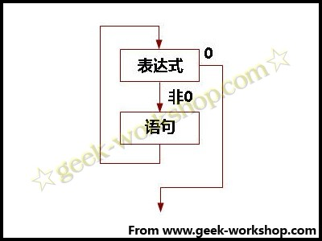

# 实验效果如下面视频（需要开音响才能听到蜂鸣器发出的声音）[http://player.youku.com/player.php/sid/XMjgzNzQ4OTU2/v.swf](http://player.youku.com/player.php/sid/XMjgzNzQ4OTU2/v.swf)第一个频率的声音为1毫秒发声1毫秒不发声。1秒等于1000毫秒，2毫秒为一个周期。得出频率为500赫兹。第二个频率的声音为2毫秒发声2毫秒不发声，4毫秒为一个周期。得出频率为250赫兹。一个事件的循环就是500赫兹的声音响80毫秒，然后250赫兹的声音响100毫秒。如此循环下去。**while()函数**本次试验使用到了while()函数在loop()中用while也是一个循环语句，一般形式：while(表达式)语句表达式是循环条件，语句是循环体。语义是：计算表达式的值，当值为真（非0）时，执行循环体语句。其执行过程可用下图表： 作用：实现“当型”循环。当“表达式”非0（真）是，执行“语句”。“语句”是被循环执行的程序，称为“循环体”。 {#http-player-youku-com-player-php-sid-xmjgznzq4otu2-v-swf-1-1-1-1000-2-500-2-2-4-250-500-80-250-100-while-while-loop-while-while-0-0}

