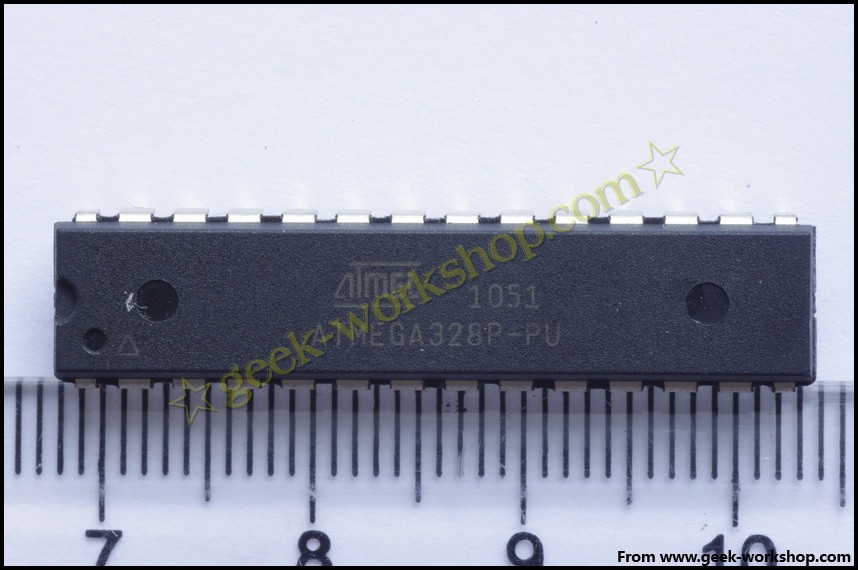

# 什么是Arduino？

#  什么是arduino？ {#arduino-1-arduino}

要了解arduino就先要了解什么是单片机，arduino平台的基础就是AVR指令集的单片机。**1、什么是单片机？它与个人计算机有什么不同？**一台能够工作的计算机要有这样几个部份构成：中央处理单元CPU（进行运算、控制）、随机存储器RAM（数据存储）、存储器ROM（程序存储）、输入/输出设备I/O（串行口、并行输出口等）。在个人计算机（PC）上这些部份被分成若干块芯片，安装在一个被称之为主板的印刷线路板上。而在单片机中，这些部份全部被做到一块集成电路芯片中了，所以就称为单片（单芯片）机，而且有一些单片机中除了上述部份外，还集成了其它部份如模拟量/数字量转换（A/D）和数字量/模拟量转换（D/A）等。**2、单片机有什么用？**实际工作中并不是任何需要计算机的场合都要求计算机有很高的性能，一个控制电冰箱温度的计算机难道要用酷睿处理器吗？应用的关键是看是否够用，是否有很好的性能价格比。如果一台冰箱都需要用酷睿处理起来进行温度控制，那价格就是天价了。单片机通常用于工业生产的控制、生活中与程序和控制有关（如：电子琴、冰箱、智能空调等）的场合。下图就是一个Atmega328P-PU单片机，基于AVR指令集的8位处理器，频率20MHz，存储器空间32KB。 **什么是Arduino？**Arduino是一个能够用来感应和控制现实物理世界的一套工具。 它由一个基于单片机并且开放源码的硬件平台，和一套为Arduino板编写程序 的开发环境组成。Arduino可以用来开发交互产品，比如它可以读取大量的开关和传感器信号，并且可以控制各式各样的电灯、电机和其他物理设备。Arduino项目可以是单独的，也可以在运行时和你电脑中运行的程序（例如：Flash，Processing，MaxMSP）进行通讯。Arduino板你可以选择自己去手动组装或是购买已经组装好的；Arduino开源的IDE可以免费下载得到。Arduino的编程语言就像似在对一个类似于物理的计算平台进行相应的连线，它基于处理多媒体的编程环境。**为什么要使用Arduino？**有很多的单片机和单片机平台都适合用做交互式系统的设计。例如：Parallax Basic Stamp， Netmedia’s BX-24，Phidgets，MIT’s Handyboard 和其它等等提供类似功能的。 所有这些工具，你都不需要去关心单片机编程繁琐的细节，提供给你的是一套容易使用的工具包。 Arduino同样也简化了同单片机工作的流程，但同其它系统相比Arduino在很多地方更具有优越性，特别适合老师，学生和一些业余爱好者们使用：

*   便宜 － 和其它平台相比，Arduino板算是相当便宜了。最便宜的Arduino版本可以自己动手制作，即使是组装好的成品，其价格也不会超过200元。
*   跨平台 － Arduino软件可以运行在Windows，Macintosh OSX，和Linux操作系统。大部分其它的单片机系统都只能运行在Windows上。
*   简易的编程环境 － 初学者很容易就能学会使用Arduino编程环境，同时它又能为高级用户提供足够多的高级应用。对于老师们来说，一般都能很方便的使用Processing 编程环境，所以如果学生学习过使用Processing 编程环境的话，那他们在使用Arduino开发环境的时候就会觉得很相似很熟悉。
*   软件开源并可扩展 － Arduino软件是开源的，对于有经验的程序员可以对其进行扩展。Arduino编程语言可以通过C++库进行扩展，如果有人想去了解技术上的细节，可以跳过Arduino语言而直接使用AVR C 编程语言（因为Arduino语言实际上是基于AVR C的）。类似的，如果你需要的话，你也可以直接往你的Arduino程序中添加AVR-C 代码。
*   硬件开源并可扩展 － Arduino板基于 Atmel 的ATMEGA8 和ATMEGA168/328 单片机。Arduino基于Creative Commons 许可协议，所以有经验的电路设计师能够根据需求设计自己的模块，可以对其扩展或改进。甚至是对于一些相对没有什么经验的用户，也可以通过制作试验板来理解Arduino是怎么工作的，省钱又省事。