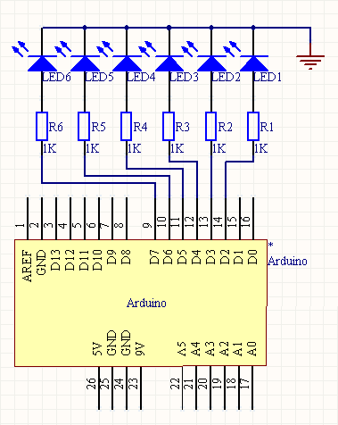
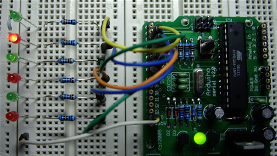

# 数字输出

Arduino的数字I/O被分成两个部分，其中每个部分都包含有6个可用的I/O管脚，即管脚2 到管脚7和管脚8到管脚13。除了管脚13上接了一个1K的电阻之外，其他各个管脚都直接连接到ATmega上。我们可以利用一个6位的数字跑马灯，来对 Arduino数字I/O的输出功能进行验证，以下是相应的原理图：

电路中在每个I/O管脚上加的那个1K电阻被称为限流电阻，由于发光二极管在电路中没有等效电阻值，使用限流电阻可以使元件上通过的电流不至于过大，能够起到保护的作用。

该工程对应的代码为：

int BASE = 2;int NUM = 6;int index = 0;void setup(){for (int i = BASE; i < BASE + NUM; i ++) {    pinMode(i, OUTPUT);}}void loop(){for (int i = BASE; i < BASE + NUM; i ++) {    digitalWrite(i, LOW);}digitalWrite(BASE + index, HIGH);index = (index + 1) % NUM;delay(100);}下载并运行该工程，连接在Arduino数字I/O管脚2到管脚7上的发光二极管会依次点亮0.1秒，然后再熄灭：

这个实验可以用来验证数字I/O输出的正确性。Arduino上一共有十二个数字I/O管脚，我们可以用同样的办法验证其他六个管脚的正确性，而这只需要对上述工程的第一行做相应的修改就可以了：

int BASE = 8;