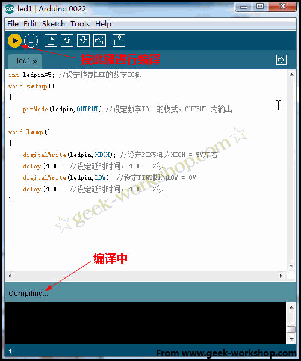
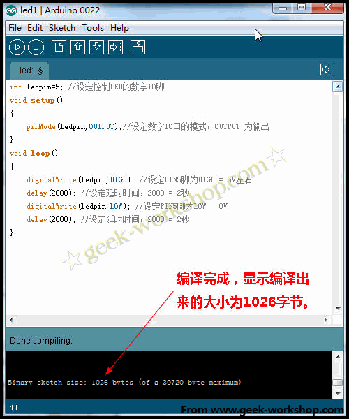
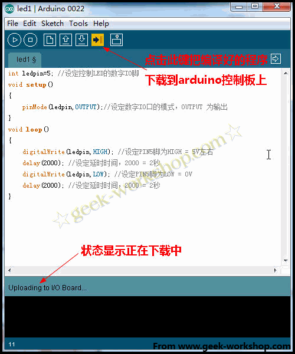
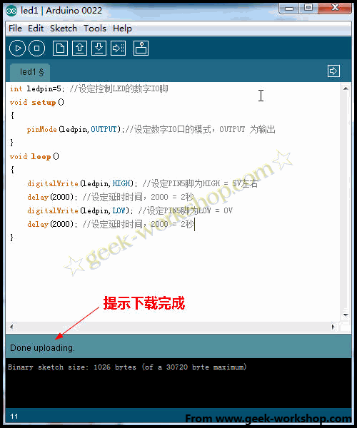
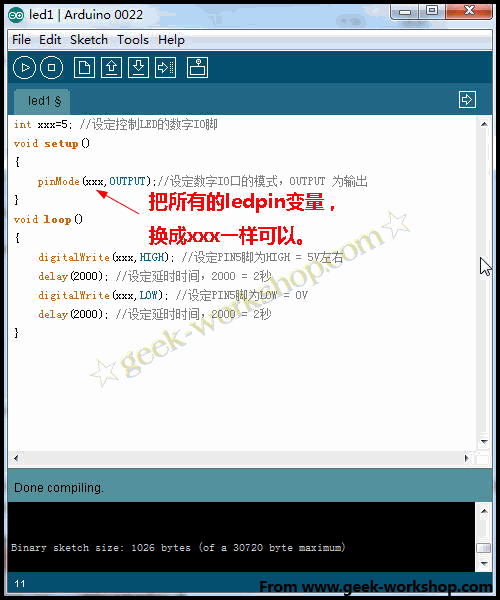

# 图中int;void setup等褐色的文字是系统命令，OUTPUT等蓝色文字是命令的功能开关，黑色文字是变量。程序写好以后点击编译按钮进行编译。 编译完成后会显示出来编译后的文件大小，本次编译出来的程序大小为1026字节。 然后把编译好的程序下载到arduino控制板上，点击下载按钮。 下载完成后会有提示 把所有的ledpin换成xxx试试，一样可以滴~~~ledpin只是自己定义的一个名字，作用只是方便识别辨认。 本次实验效果如下，闪烁着光芒的灯。。。[http://player.youku.com/player.php/sid/XMjg0MTA0Mzg4/v.swf](http://player.youku.com/player.php/sid/XMjg0MTA0Mzg4/v.swf)**总结：**int;void setup等褐色文字是系统命令，OUTPUT等蓝色文字是系统命令的功能开关，黑色文字是变量。在"int ledpin=5"中;设置了LED的数字IO脚，ledpin仅仅是5号数字端口自定义出来的名字，变成xxx等都可以。对于多脚IO操作的程序中，为每一个引脚定义名字是有必要性的，程序复杂后方便功能识别。 {#int-void-setup-output-1026-arduino-ledpin-xxx-ledpin-http-player-youku-com-player-php-sid-xmjg0mta0mzg4-v-swf-int-void-setup-output-int-ledpin-5-led-io-ledpin-5-xxx-io}

