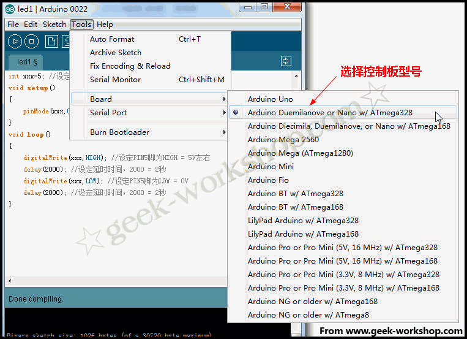

# 制作第一个电路

 单led闪烁 

做任何一个电路之前，一定要先了解电路中原件的参数，其工作电压，工作电流等。第一个实验咱们用到的LED从网上查找资料得知，其工作电压一般为1.5-2.0V，工作电流一般为10-20ma，反向击穿电压为5V。控制板逻辑电路供电为5V。根据以上参数假设LED工作电压选用1.7，工作电流选用15ma，限流电阻=（总电压-LED电压）/电流，所以限流电阻=（5-1.7）/0.015=220Ω。首先需要从arduino官方网站下载其编译软件，地址是[http://arduino.cc/en/Main/Software](http://arduino.cc/en/Main/Software)笔者使用的平台为win7 32位，如果大家使用的是其他平台，按照对应的下载就可以。下载回来的软件包解压缩后的目录结构如下图，arduino.exe是程序的启动文件，driver目录是控制板usb芯片驱动，usb接上控制板后如果要寻找驱动，把目录指定到这里就可以。 本次实验所用到的器材为一个面包板，一个LED，一个220Ω的电阻，几根导线，如下图： 本次实验的连接方法如下图，LED两个针脚有一长一短，短的是连接GND，长的是连接正极。在LED的长引脚前，需要添加一个220Ω的限流电阻。连接数字5号接口。 实物连接如下图： 通过面包板把个个电子器件连接好以后，接上USB线，设置好控制板型号、端口号。程序语言先不详解，大家先照猫画虎对着抄，后面通过各个实验，将对不同命令进行详解。编写程序前，先需要选择控制板的型号。如下图： 控制板型号选择好后，选择串口位置，笔者电脑的串口为COM3： 串口具体是多少号可以到设备管理中进行查看，如下图： 先把程序复制进去：

1.  int ledPin=5; //设定控制LED的数字IO脚
2.  void setup()
3.  {
4.  pinMode(ledPin,OUTPUT);//设定数字IO口的模式，OUTPUT 为输出
5.  }
6.  void loop()
7.  {  
8.  digitalWrite(ledPin,HIGH); //设定PIN5脚为HIGH = 5V左右
9.  delay(2000); //设定延时时间，2000 = 2秒
10.  digitalWrite(ledPin,LOW); //设定PIN5脚为LOW = 0V
11.  delay(2000); //设定延时时间，2000 = 2秒
12.  }

_复制代码_